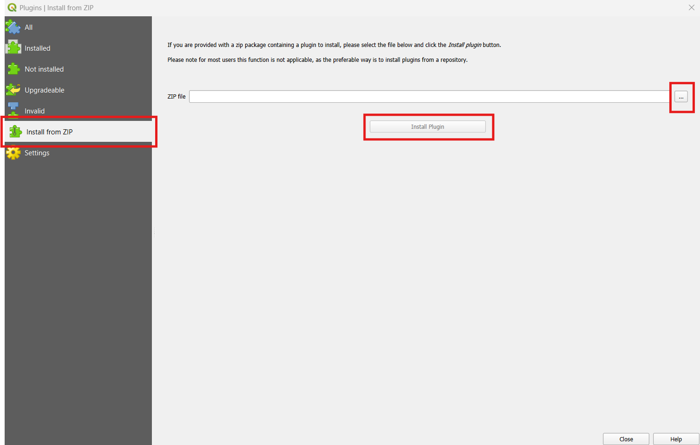
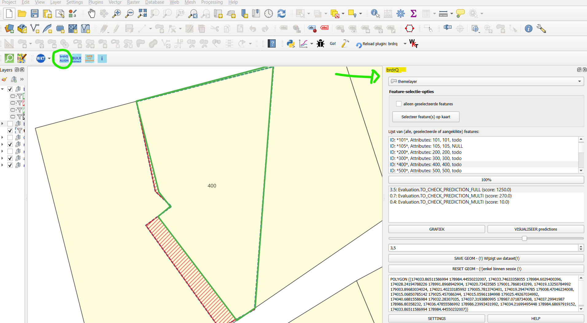

#

`brdrQ`: a QGIS-processing plugin for aligning thematic borders to reference borders. (for QGIS
v3.34.8 or higher)

<!-- badges: start -->

<!-- badges: end -->

Quick links:

- [Installation](#installation)
- [Issues, questions, comments and contributions](#comments-and-contributions)

## Description

`brdrQ` is a QGIS-processing plugin that aligns features (polygons) to reference borders: It searches for overlap relevance between thematic borders and reference borders,
and creates a resulting border based on the overlapping areas that are relevant.
The algorithm can make (one or more) 'predictions' so the user can compare and choose the right aligned geometry.

The purpose of this plugin is to automatically adjust thematic boundaries (polygons) on a reference layer (polygons)
based on a 'relevant distance'. This parameter is used in the algorithm to determine where the boundaries are
effectively adjusted to the reference layer, or where the original boundary is preserved. Thus, the adjustment of the
boundaries of resulting geometries and original geometries is at most as large as the 'relevant distance'

## Installation

You can install the latest release of `brdrQ` from
[GitHub](<https://github.com/OnroerendErfgoed/brdrQ/tree/main/dist/brdrq.zip>) by downloading this zip-distribution that can be manually installed as a plugin. 
The detailed installation-instructions can be found below.

### Pre-requisites

- Script is tested for QGIS on Linux and Windows. Usage of the script on Mac is not tested, and can give errors or
  unexpected behaviour.
- QGIS >3.34.8: The script has been developed and tested based on QGIS 3.34.8. (In older versions, the script might give
  unexpected behaviour)
- brdr needs Shapely 2.0.2 or higher. This version of Shapely is already available by default in QGIS version 3.34.8 and
  higher on Windows installations. On Linux and Mac this may not be the case. If the modules are not found, the script
  will attempt to install both 'brdr' and 'shapely' from Pypi.

### Installation-steps

At this moment, the QGIS plugin 'brdrQ' has to be installed based on a zip-folder-installation. (In future we want to
provide it as as a plugin in the QGIS-plugin-repository)
Follow the steps below to make the plugin available in the QGISToolbar and QGIS Processing Toolbox

1. Download the zip-file from the following link and save it on your local machine:
   <https://github.com/OnroerendErfgoed/brdrQ/tree/main/dist/brdrq.zip>

2. Open the 'Plugins'>>'Manage and install plugins...' from the topbar of QGIS

3. Choose: 'Install from zip' (see red box) and select the zip-file you downloaded in step 1

(While adding the script to the toolbox, the necessary python-dependencies will be installed if not yet available on
your machine.
If dependencies need to be installed, a screen like below can pop up. Please wait until installation is finished. The
screen will close automatically after installation.)

Warning: When you have already older versions of brdrQ installed, this zip-install can raise a error due to a older brdr-version-conflict. 
Please ignore this error and restart QGIS so the newer version of 'brdr' will re-install automatically.

3. After a successful installation/restart, check in the 'Installed'-tab of the QGIS Plugin Manager if the 'brdrQ'-plugin is activated (red arrow). if not, you
   have to activate the checkbox

4. The plugin 'brdrQ' is now installed as a toolbar and the brdrQProvider is also available in the Processing Toolbox. First open the
   processing toolbox and look for 'brdrQProvider'

5. Double-click on the 'Autocorrectborders' tool, and the tool opens:

 

6. The brdrQ-plugin also provides a Feature-by-Feature align tool that is available in the toolbar.

## Getting started (Quickstart - Autocorrectborders (Processing toolbox))

To start the calculation, the following steps are sufficient:

- a theme layer ((MULTI)POLYGON - EPSG:31370 or EPSG:3812) with corresponding unique ID
- a reference layer ((MULTI)POLYGON - EPSG:31370 or EPSG:3812) with corresponding unique ID
- a RELEVANT_DISTANCE (relevant distance, default 2 meters)

==>CLICK 'RUN' : The tool processes the data and the output is created and displayed in the TOC of QGIS

## Manual

The various INPUT & OUTPUT parameters are explained in more detail below. Here are some useful tips, assumptions and
limitations when using the script

### STANDARD INPUT PARAMETERS

- THEMATIC LAYER: (MULTI-)POLYGON  (EPSG:31370 or EPSG:3812)

- THEMATIC ID: Textual or numeric ID of the thematic layer used as a reference to the objects. This must be unique.

- RELEVANT DISTANCE (meter): Positive (decimal) number in meters. This
  is the distance by which the original boundary is maximally shifted to align with the reference layer. The 'Relevant
  distance' used in the algorithm to
  determine the relevant intersections and relevant differences between the thematic layer and the reference layer.
- SELECT REFERENCE LAYER: Combobox to choose which referencelayer will be used. There is a choice between on-the-fly
  downloadable referencelayers from GRB, or to use your own local REFERENCELAYER. the on-the-fly downloads are only
  possible for smaller areas.
    - LOCAL REFERENCE LAYER: The local referencelayer and unique reference ID has to be choosen from the TOC:
        - REFERENCE LAYER: Local reference layer from the TOC with the geometries you want to use as a reference (e.g.,
          GRB - administrative
          parcels)
        - REFERENCE ID: Textual or numeric ID of the reference layer used as a reference to the objects. This must be
          unique.
    - ADP: (on-the-fly download) - Actual administrative parcels from GRB (Grootschalig Referentie Bestand)
    - GBG: (on-the-fly download) - Actual buildings from GRB
    - KNW: (on-the-fly download) - Actual artwork from GRB
    - Adpf20xx: (on-the-fly download) - Fiscal versions of the administrative parcels of GRB
    - (Note: the on-the-fly downloads are only possible for a subset or small area of thematic objects as this results
      in downloading this reference-area. When using brdrQ for bigger areas a local reference layer is necessary)
- WORKING FOLDER: Folder to save the resulting geojson-files. By default empty, resulting in saving the geojson-files in
  a default folder on your machine.

### ADVANCED INPUT PARAMETERS

- OD_STRATEGY: This parameter determines how the algorithm deals with parts of the geometry that do not lie on the
  reference layer. (=public domain in the case of parcels as reference layer). There are several strategies:
    - EXCLUDE: All parts that are not covered by the reference layer are excluded from the resulting geometry
    - AS IS: All parts that are not covered by the reference layer are added AS IS to the resulting geometry
    - SNAP_SINGLE_SIDE: Based on the RELEVANT_DISTANCE, an attempt is made to shift the OD-parts of the original
      boundary inwards so that it lies on the reference layer
    - SNAP_ALL_SIDE: Based on the RELEVANT_DISTANCE, an attempt is made to shift the OD-parts of the original boundary
      inwards OR outwards so that it lies on the reference layer
    - SNAP_FULL_AREA_SINGLE_SIDE: This strategy is particularly interesting for large areas where a high
      RELEVANT_DISTANCE is required due to rough (inaccurate) drawing. The inside of the area is retained in its
      entirety and the boundary area is snapped 'single sided' (inwards) to the reference layer based on the
      RELEVANT_DISTANCE
    - SNAP_FULL_AREA_ALL_SIDE: This strategy is particularly interesting for large areas where a high RELEVANT_DISTANCE
      is required due to rough (inaccurate) drawing. The inside of the area is retained in its entirety and the boundary
      area is snapped 'all sided' (inwards and outwards) to the reference layer based on the RELEVANT_DISTANCE
    - SNAP_SINGLE_SIDE_VARIANT_1: Implementation variant of od_strategy 'SNAP_SINGLE_SIDE'
    - SNAP_SINGLE_SIDE_VARIANT_2: Implementation variant of od_strategy 'SNAP_SINGLE_SIDE'

- FULL_OVERLAP_PERCENTAGE % (0-100):  For "Doubtful" parcels where relevant zones are absent: In cases where the
  algorithm cannot decide based on relevant intersection or relevant difference whether a parcel should be retained, the
  percentage that they are covered by the original geometry is considered:
    - BIGGER THAN FULL_OVERLAP_PERCENTAGE: Parcel is retained
    - SMALLER THAN FULL_OVERLAP_PERCENTAGE: Parcel is excluded
      for example
      • 0%: "doubtful" parcels are always retained, since the overlap is always greater than 0
      • 50% (default): "doubtful" parcels are retained if they are more than half covered by the original geometry
      • 100%: "doubtful" parcels are always excluded, except if they are 100%(fully) covered

- SHOW_INTERMEDIATE_LAYERS:
    - True (Default): 2 additional layers are generated as output that visually represent the significant intersections
      and significant differences
    - False: The 2 additional layers are not added to the output
- GET_ALL_PREDICTIONS_FOR_RELEVANT_DISTANCES (Default: False):
    - When True, the code will use all relevant distances with an interval of 10cm to try to search for 'predictions'.
      These are results where the output geometry is a stable result that could be the possible wanted result.
    - The resulting layer will give alle these predicted results together with the relevant distance where this result
      is found.
- UPDATE_TO_ACTUAL_GRB_ADP_VERSION (Default: False):
    - When True, this function will use the brdr_formula and the predictions to search for a actualized version of the
      geometry based on the actual GRB-parcel borders.
    - An evaluation is added to the result based on a comparison of the base brdr_formula and the resulting
      brdr_formula:
        - When equality is detected this is listed in the evaluation-field
        - When no_equality is detected, the result has to be checked, and all predictions are listed
        - MAX_RELEVANT_DISTANCE_FOR_ACTUALISATION: This value is used to define how far an actualisation has to be
          searched.
- SHOW_LOG_INFO (default False): When True, the logging of brdr is shown in the feedback-window

### OUTPUT

The script generates several output layers in the layer overview:

* brdrQ_RESULT_X_Y: resulting geometries after alignment
* brdrQ_DIFF_X_Y: differences (+ and -) between original and resulting geometry
* brdrQ_DIFF_MIN_X_Y:differences (-) between original and resulting geometry
* brdrQ_DIFF_PLUS_X_Y:differences (+) between original and resulting geometry
* (optional) brdrQ_RLVNT_DIFF_X_Y: relevant differences (parts to exclude), used when processing the resulting geometry
* (optional) brdrQ_RLVNT_ISECT_X_Y: relevant intersection (parts to include), used when processing the resulting
  geometry

The name includes which 'RELEVANT_DISTANCE (X)' and 'OD-STRATEGY (Y)' is used

### TIPS, ASSUMPTIONS & LIMITATIONS

- Analyse your thematic dataset and try to gain insight into the 'deviation' (precision and accuracy from the reference
  layer):
    - Where does the thematic data come from?
    - when was it created,
    - on what reference limits was it drawn at the time,
    - Which drawing rules have been applied (e.g. accuracy of 0.5m)
    - …

This allows you to gain insight into the 'deviation' and which RELEVANT_DISTANCE value can best be applied.

- The RELEVANT_DISTANCE must be chosen according to the 'deviation' of the thematic data compared to the reference
  layer. If the thematic data contains different geometries that show large differences in 'deviation', it is best to
  split the thematic data and process it separately with an appropriate RELEVANT_DISTANCE so that the RELEVANT_DISTANCE
  can be kept as small as possible.
- The current version of the script assumes that both the thematic layer and reference layer are in the same CRS:
  Lambert72 (EPSG:31370) or Lambert 2008 (EPSG:3812).
- Thematic boundaries consisting of 1 or a few reference polygons are processed by the script in a few seconds. If the
  thematic boundaries cover a very large area (~1000 and reference polygons), it may take several minutes for the OUTPUT
  to be calculated. It's best to let QGIS finish this processing before proceeding
- In practice, we notice that large thematic demarcations are sometimes drawn more roughly (less precisely or
  inaccurately), so that a high RELEVANT DISTANCE is required to shift them to the reference file. For large areas that
  are drawn 'roughly', it is best to use a high RELEVANT_DISTANCE (e.g. >10 meters) and:
    - OD-strategy EXCLUDE: if you want to completely exclude all public domain
    - OD-strategy AS_IS: if you want to include all the covered public domain AS IS in the result
    - OD strategy SNAP_FULL_AREA_x: if you want to keep the public domain within the demarcation, but move the edges to
      the reference polygons

## Motivation & citation

The script uses `brdr`, a python-package to align thematic borders to reference borders.

- For more information about the conceptual method/algorithm consult:
  <https://github.com/OnroerendErfgoed/brdr>.

## Development

A released python-package of is automatically installed when installing the brdrQ-script.

A non-released (development-) version of `brdr` can be installed as QGIS-Python-site-package by:

f.e. 'C:\Program Files\QGIS 3.38.1>python -m pip install C:\x\x\x\x\brdr'

the brdr-package is installed in a user-directory:

f.e. 'C:\Users\x\AppData\Roaming\Python\Python312\site-packages'

## Comments and contributions

We would love to hear from you and your experiences with
`brdrQ` or its sister project [`brdr`](https://github.com/OnroerendErfgoed/brdr/).
The [discussions forum](https://github.com/OnroerendErfgoed/brdr/discussions/) is the place to be when:

- You have any questions on using `brdrQ` or `brdr` or their
  applicability to your use cases
- Want to share your experiences with the library
- Have any suggestions for improvements or feature requests

If you have discovered a bug in the `brdrQ` library you can report it here:

<https://github.com/OnroerendErfgoed/brdrQ/issues>

We try to keep the list of issues as clean as possible. If
you're unsure whether something is a bug, or whether the bug is in `brdrQ`
or `brdr`, we encourage you to go through the [discussions forum](https://github.com/OnroerendErfgoed/brdr/discussions)
first.

## Acknowledgement

This software was created by [Athumi](https://athumi.be/en/), the Flemish data utility company,
and [Flanders Heritage Agency](https://www.onroerenderfgoed.be/flanders-heritage-agency).

