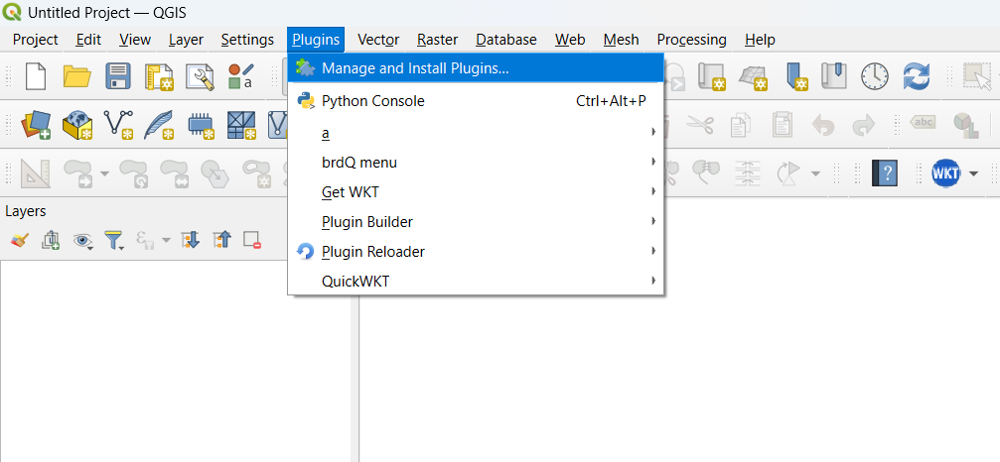
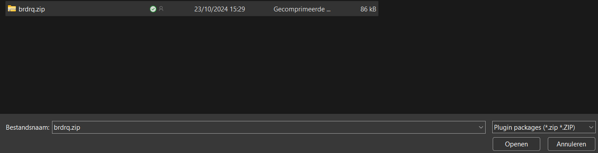
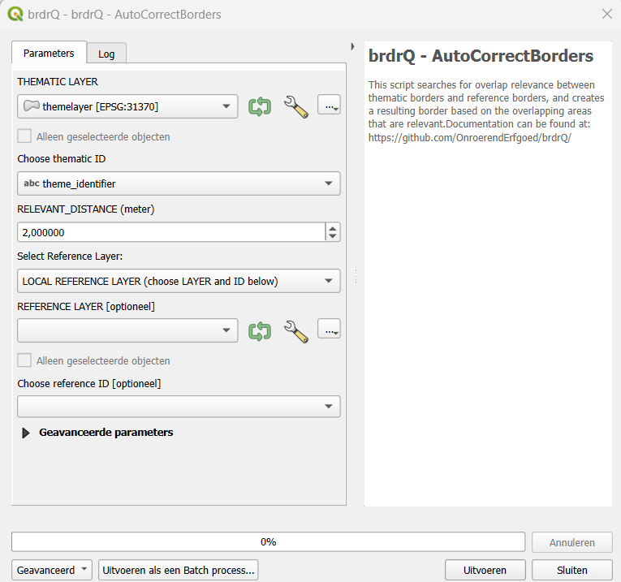

# `brdrQ`: Autocorrectborders, a QGIS-processing script for aligning thematic borders to reference borders.

<!-- badges: start -->

<!-- badges: end -->

## Description

`brdrQ` is a QGIS-processing script that searches for overlap relevance between thematic borders and reference borders, and creates a resulting border based on the overlapping areas that are relevant.

The purpose of this script is to automatically adjust thematic boundaries (polygons) on a reference layer (polygons) based on a 'relevant distance'. This parameter is used in the algorithm to determine where the boundaries are effectively adjusted to the reference layer, or where the original boundary is preserved. Thus, the adjustment of the boundaries of resulting geometries and original geometries is at most as large as the 'relevant distance'

## Installation

You can install the latest release of `brdrQ` from
[GitHub](https://github.com/OnroerendErfgoed/brdrQ/).

### Pre-requisites
- Script is tested for QGIS on Linux and Windows. Usage of the script on Mac is not tested, and can give errors or unexpected behaviour.
- QGIS >3.28.5: The script has been developed and tested based on QGIS 3.28.5. In older versions, the script will not work)
- brdr needs Shapely 2.0.2 or higher. This version of Shapely is available by default from QGIS 3.28.5 onwards on Windows installations. On Linux and Mac this may not be the case. If the modules are not found, the script will attempt to install both brdr and shapely from Pypi. 

### Installation-steps
The QGIS script 'autocorrectborders.py can be loaded into the QGIS Processing Toolbar.
Follow the steps below to make the script available in QGIS Processing Toolbar
1.  Open the Processing Toolbox from the bar at the top, so that Processing Toolbox appears on the right side of the screen

2.	Choose: 'Add script to Toolbox...' (see red arrow) and select the script 'autocorrectborders.py'

(While adding the script to the toolbox, the necessary python-dependencies will be installed if not yet available on your machine.
If dependencies need to be installed, a screen like below can pop up. Please wait until installation is finished. The screen will close automatically after installation.)

3. Close your QGIS-project, and Re-open your QGIS-project

4.	The tool 'Autocorrectborders' is now available in the Processing Toolbox under 'brdrQ'

5.	Double-click on the 'Autocorrectborders' tool, and the tool opens:

 

## Getting started (example)

To start the calculation, the following steps are sufficient:

- a theme layer ((MULTI)POLYGON - EPSG:31370 or EPSG:3812) with corresponding unique ID
- a reference layer ((MULTI)POLYGON  - EPSG:31370 or EPSG:3812) with corresponding unique ID
- a RELEVANT_DISTANCE (relevant distance)
- A public-domain strategy

==>CLICK 'RUN' : The tool processes the data and the output is created and displayed in the TOC of QGIS

## Manual

The various INPUT & OUTPUT parameters are explained in more detail below. Here are some useful tips, assumptions and limitations when using the script

### INPUT

- THEMATIC LAYER: (MULTI-)POLYGON  (EPSG:31370 or EPSG:3812)

- THEMATIC ID: Textual or numeric ID of the thematic layer used as a reference to the objects. This must be unique.

- REFERENCE LAYER: Reference layer with the geometries you want to use as a reference (e.g., GRB - administrative parcels)

- REFERENCE ID: Textual or numeric ID of the reference layer used as a reference to the objects. This must be unique.

- RELEVANT DISTANCE (meter): Positive (decimal) number in meters. The 'Relevant distance' used in the algorithm to determine the relevant intersections and relevant differences between the thematic layer and the reference layer. This is the distance by which the original boundary is maximally shifted to align with the reference layer.

- OD_STRATEGY: This parameter determines how the algorithm deals with parts of the geometry that do not lie on the reference layer. (=public domain in the case of parcels as reference layer). There are several strategies:
  - EXCLUDE: All parts that are not covered by the reference layer are excluded from the resulting geometry
  - AS IS: All parts that are not covered by the reference layer are added AS IS to the resulting geometry
  - SNAP_SINGLE_SIDE: Based on the RELEVANT_DISTANCE, an attempt is made to shift the OD-parts of the original boundary inwards so that it lies on the reference layer
  - SNAP_ALL_SIDE: Based on the RELEVANT_DISTANCE, an attempt is made to shift the OD-parts of the  original boundary inwards OR outwards so that it lies on the reference layer
  - SNAP_FULL_AREA_SINGLE_SIDE: This strategy is particularly interesting for large areas where a high RELEVANT_DISTANCE is required due to rough (inaccurate) drawing. The inside of the area is retained in its entirety and the boundary area is snapped 'single sided' (inwards) to the reference layer based on the RELEVANT_DISTANCE
  - SNAP_FULL_AREA_ALL_SIDE: This strategy is particularly interesting for large areas where a high RELEVANT_DISTANCE is required due to rough (inaccurate) drawing. The inside of the area is retained in its entirety and the boundary area is snapped 'all sided' (inwards and outwards) to the reference layer based on the RELEVANT_DISTANCE
  - SNAP_SINGLE_SIDE_VARIANT_1: Implementation variant of od_strategy 'SNAP_SINGLE_SIDE'
  - SNAP_SINGLE_SIDE_VARIANT_2: Implementation variant of od_strategy 'SNAP_SINGLE_SIDE'

- FULL_OVERLAP_PERCENTAGE % (0-100):  For "Doubtful" parcels where relevant zones are absent: In cases where the algorithm cannot decide based on relevant intersection or relevant difference whether a parcel should be retained, the percentage that they are covered by the original geometry is considered:
  - BIGGER THAN FULL_OVERLAP_PERCENTAGE: Parcel is retained
  - SMALLER THAN FULL_OVERLAP_PERCENTAGE: Parcel is excluded
  for example
  •   0%: "doubtful" parcels are always  retained, since the overlap is always greater than 0
  •   50% (default): "doubtful" parcels are retained if they are more than half covered by the original geometry
  •   100%: "doubtful" parcels are always excluded, except if they are 100%(fully) covered

- PROCESS_MULTI_AS_SINGLE_POLYGONS:
  - True (default): the input geometry is converted to separate SINGLE polygons at startup and processed by the algorithm as SINGLE polygons. After processing, these are merged back together
  - False: the input geometry is processed in its entirety by the algorithm

- SHOW_INTERMEDIATE_LAYERS:
  - True: 2 additional layers are generated as output that visually represent the significant intersections and significant differences
  - False (Default): The 2 additional layers are not added to the output

### OUTPUT
The script generates several output layers in the layer overview: 

* brdrQ_RESULT_X_Y: resulting geometries after alignment
* brdrQ_DIFF_X_Y: differences (+ and -) between original and resulting geometry
* brdrQ_DIFF_MIN_X_Y:differences (-) between original and resulting geometry
* brdrQ_DIFF_PLUS_X_Y:differences (+) between original and resulting geometry
* (optional) brdrQ_RLVNT_DIFF_X_Y: relevant differences (parts to exclude), used when processing the resulting geometry
* (optional) brdrQ_RLVNT_ISECT_X_Y: relevant intersection (parts to include), used when processing the resulting geometry

The name includes which 'RELEVANT_DISTANCE (X)' and 'OD-STRATEGY (Y)' is used
 

### TIPS, ASSUMPTIONS & LIMITATIONS
- Analyse your thematic dataset and try to gain insight into the 'deviation' (precision and accuracy from the reference layer): 
  - Where does the thematic data come from? 
  - when was it created, 
  - on what reference limits was it drawn at the time,
  - Which drawing rules have been applied (e.g. accuracy of 0.5m)
  - …

This allows you to gain insight into the 'deviation' and which RELEVANT_DISTANCE value can best be applied.
- The RELEVANT_DISTANCE must be chosen according to the 'deviation' of the thematic data compared to the reference layer. If the thematic data contains different geometries that show large differences in 'deviation', it is best to split the thematic data and process it separately with an appropriate RELEVANT_DISTANCE so that the RELEVANT_DISTANCE can be kept as small as possible. 
- The current version of the script assumes that both the thematic layer and reference layer are in the same CRS: Lambert72 (EPSG:31370) or Lambert 2008 (EPSG:3812).
- Thematic boundaries consisting of 1 or a few reference polygons are processed by the script in a few seconds. If the thematic boundaries cover a very large area (~1000 and reference polygons), it may take several minutes for the OUTPUT to be calculated. It's best to let QGIS finish this processing before proceeding
- In practice, we notice that large thematic demarcations are sometimes drawn more roughly (less precisely or inaccurately), so that a high RELEVANT DISTANCE is required to shift them to the reference file. For large areas that are drawn 'roughly', it is best to use a high RELEVANT_DISTANCE (e.g. >10 meters) and:
  - OD-strategy EXCLUDE: if you want to completely exclude all public domain
  - OD-strategy AS_IS: if you want to include all the covered public domain AS IS in the result
  - OD strategy SNAP_FULL_AREA_x: if you want to keep the public domain within the demarcation, but move the edges to the reference polygons

## Motivation & citation

The script uses `brdr`, a python-package to align thematic borders to reference borders.

- For more information about the conceptual method/algorithm consult:
<https://github.com/OnroerendErfgoed/brdr>.

## Comments and contributions

- Please report any issues or bugs here:
<https://github.com/OnroerendErfgoed/brdrQ/issues>.

