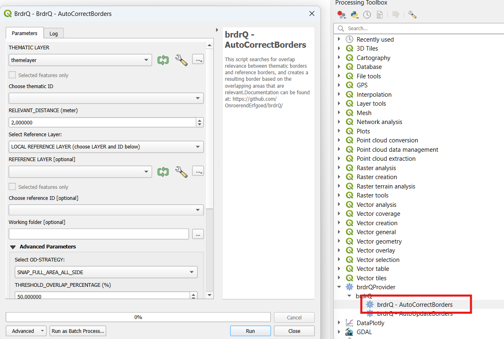
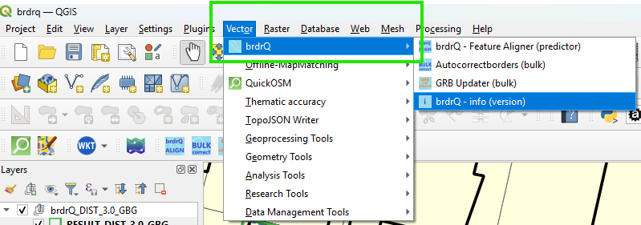

#

`brdrQ`: a QGIS-processing plugin for aligning thematic borders to reference borders. (for QGIS
v3.34.8 or higher)

<!-- badges: start -->

<!-- badges: end -->

Quick links:

- [Installation](#installation)
- [Issues, questions, comments and contributions](#comments-and-contributions)

## Description

`brdrQ` is a QGIS-processing plugin that aligns features (polygons) to reference borders: It searches for overlap relevance between thematic borders and reference borders,
and creates a resulting border based on the overlapping areas that are relevant.
The algorithm can make (one or more) 'predictions' so the user can compare and choose the right aligned geometry.

The purpose of this plugin is to automatically adjust thematic boundaries (polygons) on a reference layer (polygons)
based on a 'relevant distance'. This parameter is used in the algorithm to determine where the boundaries are
effectively adjusted to the reference layer, or where the original boundary is preserved. Thus, the adjustment of the
boundaries of resulting geometries and original geometries is at most as large as the 'relevant distance'

## Installation

### Pre-requisites

- Plugin is tested for QGIS on Windows. Usage of the plugin on Mac and Linux is not tested, and can give errors or
  unexpected behaviour.
- QGIS >3.34.8: The plugin has been developed and tested based on QGIS 3.34.8. (In older versions, the plugin might give
  unexpected behaviour)
- brdr needs Shapely 2.0.2 or higher. This version of Shapely is already available by default in QGIS version 3.34.8 and
  higher on Windows installations. On Linux and Mac this may not be the case. If the modules are not found, the plugin
  will attempt to install both 'brdr' and 'shapely' from Pypi.

  
### Installation-steps

You can install the latest release of `brdrQ` by adding a custom plugin-repository-url: https://github.com/OnroerendErfgoed/brdrQ/raw/refs/heads/main/dist/plugins.xml , so brdrQ will become available in the plugin-list. 

Please follow the steps below to make the plugin available:

1. Open the 'Plugins'>>'Manage and install plugins...' from the topbar of QGIS

2a. Choose: 'Settings' and use the 'Add'-button to add the following repository: https://github.com/OnroerendErfgoed/brdrQ/raw/refs/heads/main/dist/plugins.xml

2b. When the custom repo is succesfully added, 'brdrQ' will appear in the list of available plugins:

2c. The plugin can be installed by clicking: 'Install plugin':

2d. In some cases a 'ModuleNotFound'-Error like below will popup because the right version of 'brdr' is not yet available in QGIS.  
When this error occurs, please ignore this error and restart QGIS so the newer version of 'brdr' will re-install automatically and the brdrQ-plugin will become available.

(While adding the plugin to QGIS, the necessary python-dependencies will be installed if not yet available on
your machine. If dependencies need to be installed, a screen like below can pop up. Please wait until installation is finished. The
screen will close automatically after installation.)

3. After a successful installation/restart, check in the 'Installed'-tab of the QGIS Plugin Manager if the 'brdrQ'-plugin is activated (red arrow). if not, you
   have to activate the checkbox

4. The plugin 'brdrQ' is now installed as a toolbar and the brdrQProvider is also available in the Processing Toolbox. First open the
   processing toolbox and look for 'brdrQProvider'

5. Double-click on the 'Autocorrectborders' tool, and the tool opens:

 

6. The brdrQ-plugin also provides a Feature-by-Feature align tool that is available in the toolbar.

## The brdrQ - PLUGIN

The brdrQ-plugin adds a toolbar, a toolmenu (vector) & a brdrQ processing provider (processing toolbox) with several tools. You can find a link to the docs of each tool/script below.

### brdrQ Tool Menu (vector)

### brdrQ Toolbar

### brdrQ Processing provider

### Tools/Scripts
- A custom tool (feature-by-feature):
  - **FeatureAligner (predictor)**: Custom tool to align feature-by-feature based on predictions [link to documentation](docs/featurealigner.md)
- 2 processing algorithm scripts (bulk):
  - **AutoCorrectBorders**:Processing algorithm to align polygons based on a specific relevant distance [link to documentation](docs/autocorrectborders.md)
  - **AutoUpdateBorders (GRB Updater)**: Processing algorithm to update/align features based on the actual situation of the GRB [link to documentation](docs/autoupdateborders.md)
- Plugin version information: overview of the version of brdr and brdrQ

(Also note that these processing algorithms can also be used inside the model builder to 'chain' processes)

## Motivation & citation

The plugin uses `brdr`, a python-package to align thematic borders to reference borders.

- For more information about the conceptual method/algorithm consult:
  <https://github.com/OnroerendErfgoed/brdr>.

## Development

A released python-package of `brdr` is automatically installed when installing the brdrQ-plugin.

A non-released (development-) version of `brdr` can be installed as QGIS-Python-site-package by:

f.e. 'C:\Program Files\QGIS 3.38.1>python -m pip install C:\x\x\x\x\brdr'

the brdr-package is installed in a user-directory:

f.e. 'C:\Users\x\AppData\Roaming\Python\Python312\site-packages'

## Comments and contributions

We would love to hear from you and your experiences with
`brdrQ` or its sister project [`brdr`](https://github.com/OnroerendErfgoed/brdr/).
The [discussions forum](https://github.com/OnroerendErfgoed/brdr/discussions/) is the place to be when:

- You have any questions on using `brdrQ` or `brdr` or their
  applicability to your use cases
- Want to share your experiences with the library
- Have any suggestions for improvements or feature requests

If you have discovered a bug in the `brdrQ` library you can report it here:

<https://github.com/OnroerendErfgoed/brdrQ/issues>

We try to keep the list of issues as clean as possible. If
you're unsure whether something is a bug, or whether the bug is in `brdrQ`
or `brdr`, we encourage you to go through the [discussions forum](https://github.com/OnroerendErfgoed/brdr/discussions)
first.

## Acknowledgement

This software was created by [Athumi](https://athumi.be/en/), the Flemish data utility company,
and [Flanders Heritage Agency](https://www.onroerenderfgoed.be/flanders-heritage-agency).

