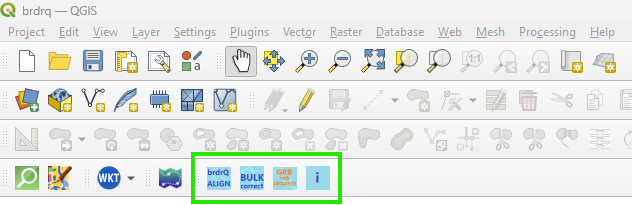

#

`brdrQ`: a QGIS-processing plugin for aligning thematic borders to reference borders. (for QGIS
v3.34.8 or higher)

<!-- badges: start -->

<!-- badges: end -->

Quick links:

- [Installation](#installation)
- [Issues, questions, comments and contributions](#comments-and-contributions)

## Description

`brdrQ` is a QGIS-processing plugin that aligns features (polygons) to reference borders: It searches for overlap
relevance between thematic borders and reference borders,
and creates a resulting border based on the overlapping areas that are relevant.
The algorithm can make (one or more) 'predictions' so the user can compare and choose the right aligned geometry.

The purpose of this plugin is to automatically adjust thematic boundaries (polygons) on a reference layer (polygons)
based on a 'relevant distance'. This parameter is used in the algorithm to determine where the boundaries are
effectively adjusted to the reference layer, or where the original boundary is preserved. Thus, the adjustment of the
boundaries of resulting geometries and original geometries is at most as large as the 'relevant distance'

## Installation

* Windows-users: Use the QGIS PluginManager to install brdrQ from the official QGIS-repo:
  

* Ubuntu/Linux/Mac: Please try to install brdrQ by using the QGIS PluginManager (see Windows-install). For newer
  versions of Ubuntu/Linux it could be needed to run QGIS inside a virtual environment. You can use the following script
  to create a virtual environment and run QGIS before following the installation steps
  below: [linux_venv_qgis.sh](dist/linux_venv_qgis.sh). Usage of the plugin on Mac is not tested, and can give errors or
  unexpected behaviour.

### Pre-requisites

- 3.36 <= QGIS-version < 4.x :  The plugin has been developed and tested based on QGIS 3.36. In older versions, the plugin might give
  unexpected behaviour. Adaptations for QGIS 4 are not yet available.
- brdrQ is dependent on some other python packages (brdr,Shapely,...). If these packages are not found, the plugin
  will attempt to install both 'brdr', 'shapely' and others from Pypi.

## The brdrQ - PLUGIN

The brdrQ-plugin adds a toolbar, a toolmenu (vector) & a brdrQ processing provider (processing toolbox) with several
tools. You can find a link to the docs of each tool/script below.

### brdrQ Tool Menu (vector)

### brdrQ Toolbar

### brdrQ Processing provider

### Tools/Scripts

- A custom tool (feature-by-feature):
    - **FeatureAligner (predictor)**: Custom tool to align feature-by-feature based on
      predictions [link to documentation](docs/featurealigner.md)
- a processing algorithm script (bulk):
    - **AutoCorrectBorders**:Processing algorithm to align polygons based on a specific relevant
      distance [link to documentation](docs/autocorrectborders.md)
    - **AutoUpdateBorders (GRB Updater)**: Processing algorithm to update/align features based on the actual situation of the GRB (Flanders - Belgium) [link to documentation](docs/autoupdateborders.md)
- Plugin version information: overview of the version of brdr and brdrQ

(Also note that these processing algorithms can also be used inside the QGIS ModelBuilder to 'chain' processes)

## Motivation & citation

The plugin uses `brdr`, a python-package to align thematic borders to reference borders.

- For more information about the conceptual method/algorithm consult:
  <https://github.com/OnroerendErfgoed/brdr>.

## Development

A released python-package of `brdr` is automatically installed when installing the brdrQ-plugin.

A non-released (development-) version of `brdr` can be installed as QGIS-Python-site-package by:

f.e. 'C:\Program Files\QGIS 3.38.1>python -m pip install C:\x\x\x\x\brdr'

the brdr-package is installed in a user-directory:

f.e. 'C:\Users\x\AppData\Roaming\Python\Python312\site-packages'

## Comments and contributions

We would love to hear from you and your experiences with
`brdrQ` or its sister project [`brdr`](https://github.com/OnroerendErfgoed/brdr/).
The [discussions forum](https://github.com/OnroerendErfgoed/brdr/discussions/) is the place to be when:

- You have any questions on using `brdrQ` or `brdr` or their
  applicability to your use cases
- Want to share your experiences with the library
- Have any suggestions for improvements or feature requests

If you have discovered a bug in the `brdrQ` library you can report it here:

<https://github.com/OnroerendErfgoed/brdrQ/issues>

We try to keep the list of issues as clean as possible. If
you're unsure whether something is a bug, or whether the bug is in `brdrQ`
or `brdr`, we encourage you to go through the [discussions forum](https://github.com/OnroerendErfgoed/brdr/discussions)
first.

## Acknowledgement

This software was created by [Athumi](https://athumi.be/en/), the Flemish data utility company,
and [Flanders Heritage Agency](https://www.onroerenderfgoed.be/flanders-heritage-agency).

