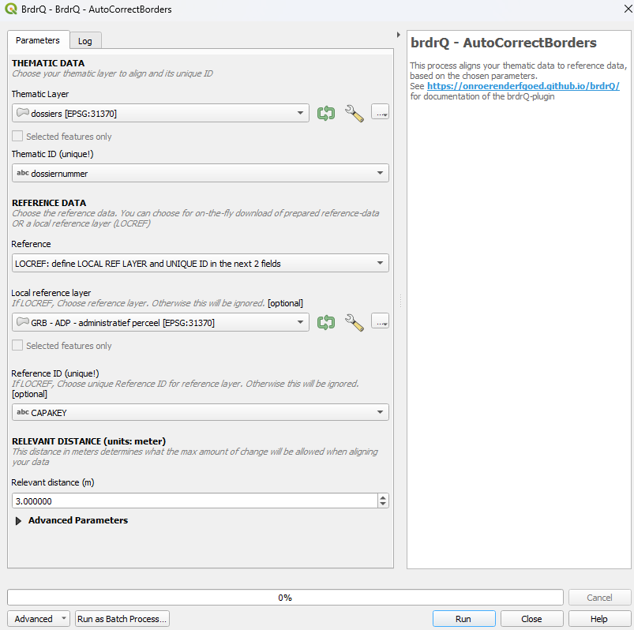

# Documentation of QGIS Python Script: Autocorrectborders


## Description
The processing algorithm, named **Autocorrectborders**, is developed to automatically adjust thematic boundaries to reference boundaries. It searches for relevant overlap between thematic boundaries and reference boundaries, and creates a resulting boundary based on the relevant overlapping areas.

## Input Parameters
The script requires the following input parameters:

- **Thematic Layer**: A (MULTI)POLYGON layer with EPSG:31370 or EPSG:3812 coordinates and a unique ID.
  - **Default**: No default value, must be provided by the user.
  - **Optional**: No.

- **Thematic ID**: Textual or numeric ID of the thematic layer used as a reference to the objects. This must be unique.
  - **Default**: No default value, must be provided by the user.
  - **Optional**: No.

- **Reference Layer**: A (MULTI)POLYGON layer with EPSG:31370 or EPSG:3812 coordinates. Combobox to choose which referencelayer will be used. There is a choice between on-the-fly
  downloadable referencelayers from GRB, or to use your own local REFERENCELAYER. 
  - The local referencelayer and unique reference ID has to be choosen from the TOC:
  - The on-the-fly downloads are only
    possible for smaller areas. 

      - ADP: (on-the-fly download) - Actual administrative parcels from GRB (Grootschalig Referentie Bestand)
      - GBG: (on-the-fly download) - Actual buildings from GRB
      - KNW: (on-the-fly download) - Actual artwork from GRB
      - Adpf20xx: (on-the-fly download) - Fiscal versions of the administrative parcels of GRB
      - (Note: the on-the-fly downloads are only possible for a subset or small area of thematic objects as this results
        in downloading this reference-area. When using brdrQ for bigger areas a local reference layer is necessary)
  - **Default**: No default value, must be provided by the user.
  - **Optional**: No.

- **Reference ID**: Textual or numeric ID of the reference layer used as a reference to the objects. This must be
          unique.
  - **Default**: No default value.
  - **Optional**: Yes.

- **Relevant Distance (meters)**: Positive (decimal) number in meters. This
  is the distance by which the original boundary is maximally shifted to align with the reference layer. The 'Relevant
  distance' used in the algorithm to
  determine the relevant intersections and relevant differences between the thematic layer and the reference layer.
  - **Default**: 3 (meters)
  - **Optional**: No.

### ADVANCED INPUT PARAMETERS

- **OD_STRATEGY**: This parameter determines how the algorithm deals with parts of the geometry that do not lie on the
  reference layer. (=public domain in the case of parcels as reference layer). There are several strategies:
    - EXCLUDE (-1): All parts that are not covered by the reference layer are excluded from the resulting geometry
    - AS IS (0): All parts that are not covered by the reference layer are added AS IS to the resulting geometry
    - SNAP_SINGLE_SIDE (1): Based on the RELEVANT_DISTANCE, an attempt is made to shift the OD-parts of the original
      boundary inwards so that it lies on the reference layer
    - SNAP_ALL_SIDE (2): Based on the RELEVANT_DISTANCE, an attempt is made to shift the OD-parts of the original boundary
      inwards OR outwards so that it lies on the reference layer
  - **Default**: SNAP_ALL_SIDE (2)
  - **Optional**: No.

- **FULL_OVERLAP_PERCENTAGE % (0-100)**:  For "Doubtful" parcels where relevant zones are absent: In cases where the
  algorithm cannot decide based on relevant intersection or relevant difference whether a parcel should be retained, the
  percentage that they are covered by the original geometry is considered:
    - BIGGER THAN FULL_OVERLAP_PERCENTAGE: Parcel is retained
    - SMALLER THAN FULL_OVERLAP_PERCENTAGE: Parcel is excluded
      for example
      • 0%: "doubtful" parcels are always retained, since the overlap is always greater than 0
      • 50% (default): "doubtful" parcels are retained if they are more than half covered by the original geometry
      • 100%: "doubtful" parcels are always excluded, except if they are 100%(fully) covered
  - **Default**: 50 (%)
  - **Optional**: No.

- **REVIEW_PERCENTAGE % (0-100)**: Results that changed more than this percentage are getting a status 'to_review'
    - Difference (%) >  REVIEW_PERCENTAGE: brdrQ_state = 'to_review'
    - Difference (%) < REVIEW_PERCENTAGE: brdrQ_state = 'auto_updated'
  - **Default**: 10 (%)
  - **Optional**: No.

- **WORKING FOLDER**: Folder to save the resulting geojson-files. By default empty, resulting in saving the geojson-files in
  a default folder on your machine.
  - **Default**: By default, the output will be saved in a local folder on your machine.
  - **Optional**: yes.

- **SHOW_INTERMEDIATE_LAYERS**:
    - True (Default): 2 additional layers are generated as output that visually represent the significant intersections
      and significant differences
    - False: The 2 additional layers are not added to the output
- **GET_BEST_PREDICTION_FOR_RELEVANT_DISTANCES (!slower!)** (Default: False):
    - When True, the code will use all relevant distances with an interval of 10cm to try to search for 'predictions'.
      These are results where the output geometry is a stable result that could be the possible wanted result.
    - The resulting layer will use the prediction with the highest prediction score.
    - Warning : When this option is used, the processing will be much slower, as a multitude of calculations are needed.
  - **Default**: False
  - **Optional**: No.

- **SHOW_LOG_INFO** (default False): When True, the logging of brdr is shown in the feedback-window
  - **Default**: False
  - **Optional**: No.


## Output Parameters

The script generates several output layers in the layer overview:

* brdrQ_RESULT_X_Y: resulting geometries after alignment
* brdrQ_DIFF_X_Y: differences (+ and -) between original and resulting geometry
* brdrQ_DIFF_MIN_X_Y:differences (-) between original and resulting geometry
* brdrQ_DIFF_PLUS_X_Y:differences (+) between original and resulting geometry
* (optional) brdrQ_RLVNT_DIFF_X_Y: relevant differences (parts to exclude), used when processing the resulting geometry
* (optional) brdrQ_RLVNT_ISECT_X_Y: relevant intersection (parts to include), used when processing the resulting
  geometry

The name includes which 'RELEVANT_DISTANCE (X)' and 'OD-STRATEGY (Y)' is used


## Example of Usage
Here is an example of how to use the script in Python:

```python

params = {
                "INPUT_THEMATIC": themelayername,
                "COMBOBOX_ID_THEME": "theme_identifier",
                "RELEVANT_DISTANCE": 2,
                "ENUM_REFERENCE": 1,
                "INPUT_REFERENCE": None,
                "COMBOBOX_ID_REFERENCE": "",
                "WORK_FOLDER": "",
                "ENUM_OD_STRATEGY": 3,
                "THRESHOLD_OVERLAP_PERCENTAGE": 50,
                "ADD_FORMULA": True,
                "ADD_ATTRIBUTES": True,
                "SHOW_INTERMEDIATE_LAYERS": True,
                "PREDICTIONS": False,
                "SHOW_LOG_INFO": False,
            }

processing.run('brdrqprovider:brdrqautocorrectborders',params)

```
## TIPS

- Analyse your thematic dataset and try to gain insight into the 'deviation' (precision and accuracy from the reference
  layer):
    - Where does the thematic data come from?
    - when was it created,
    - on what reference limits was it drawn at the time,
    - Which drawing rules have been applied (e.g. accuracy of 0.5m)
    - …

This allows you to gain insight into the 'deviation' and which RELEVANT_DISTANCE value can best be applied.

- The RELEVANT_DISTANCE must be chosen according to the 'deviation' of the thematic data compared to the reference
  layer. If the thematic data contains different geometries that show large differences in 'deviation', it is best to
  split the thematic data and process it separately with an appropriate RELEVANT_DISTANCE so that the RELEVANT_DISTANCE
  can be kept as small as possible.
- The current version of the script assumes that both the thematic layer and reference layer are in the same CRS:
  Lambert72 (EPSG:31370) or Lambert 2008 (EPSG:3812).
- Thematic boundaries consisting of 1 or a few reference polygons are processed by the script in a few seconds. If the
  thematic boundaries cover a very large area (~1000 and reference polygons), it may take several minutes for the OUTPUT
  to be calculated. It's best to let QGIS finish this processing before proceeding
- In practice, we notice that large thematic demarcations are sometimes drawn more roughly (less precisely or
  inaccurately), so that a high RELEVANT DISTANCE is required to shift them to the reference file. For large areas that
  are drawn 'roughly', it is best to use a high RELEVANT_DISTANCE (e.g. >10 meters) and:
    - OD-strategy EXCLUDE: if you want to completely exclude all public domain
    - OD-strategy AS_IS: if you want to include all the covered public domain AS IS in the result
    - OD strategy SNAP_SINGLE_SIDE: if you want to keep the public domain within the demarcation, but move the edges to
      the inner side of the thematic polygon
    - OD strategy SNAP_ALL_SIDE: if you want to keep the public domain within the demarcation, but move the edges to
      the inner & outer side of the thematic polygon
