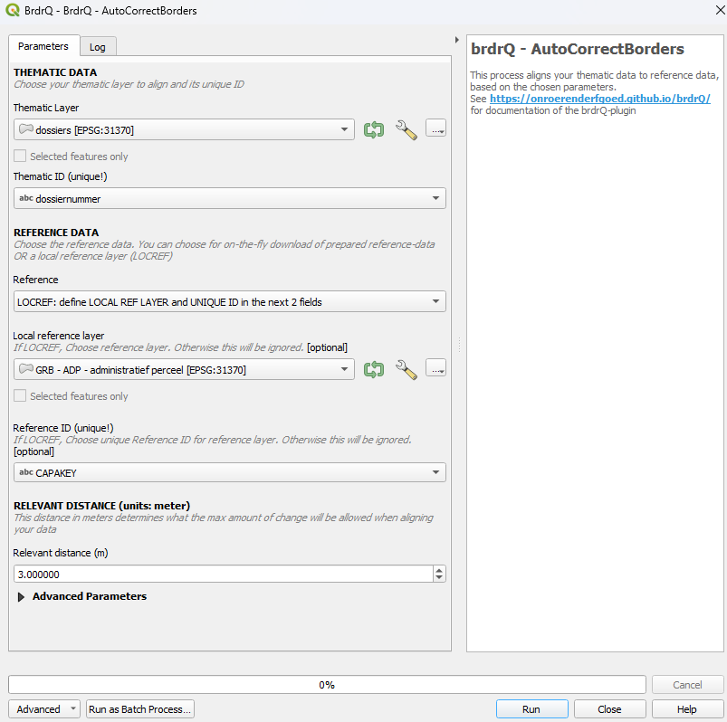

# Documentation of QGIS Python plugin brdrQ -  Autocorrectborders


## Video




## Description



The processing algorithm, named **Autocorrectborders**, is developed to automatically adjust thematic boundaries to
reference boundaries. It searches for relevant overlap between thematic boundaries and reference boundaries, and creates
a resulting boundary based on the relevant overlapping areas.

## Parameter Guide
Each parameter is documented once with the same structure: **Definition**, **Why use it**, **Choices**, and **Impact**.

### Thematic Layer
- **Definition**: Input vector layer (polygon, line, or point) in projected CRS (meters).
- **Why use it**: Defines the geometry that will be corrected.
- **Choices**: Any valid layer with stable geometry and valid CRS.
- **Impact**: Invalid CRS or mixed quality input causes unreliable alignment.

### Thematic ID
- **Definition**: Unique feature identifier in the thematic layer.
- **Why use it**: Keeps feature lineage and output traceable.
- **Choices**: Text or numeric field with unique values.
- **Impact**: Non-unique IDs can break one-to-one interpretation of results.

### Reference / Local reference layer / Reference ID (unique!)
- **Definition**: Reference source selection (LOCREF or GRB on-the-fly) + reference ID field.
- **Why use it**: Determines geometric truth for snapping/alignment.
- **Choices**: Local reference for large/stable workflows; GRB for direct service-based reference.
- **Impact**: Better reference quality directly improves output quality.

### Relevant Distance (meters)
- **Definition**: Maximum allowed geometry shift.
- **Why use it**: Controls how far features may move to match reference.
- **Choices**: Low (1-2), medium (3-5), high (>10) depending on source quality.
- **Impact**: Lower values are conservative/faster; higher values are stronger/slower and may increase review cases.

### Use predictions
- **Definition**: Enables full-scan candidate search over distance steps.
- **Why use it**: Finds stable candidates in ambiguous situations.
- **Choices**: False (quick scan) or True (full scan).
- **Impact**: True improves candidate quality but increases processing time.

### Prediction Strategy
- **Definition**: Output policy when multiple predictions exist.
- **Why use it**: Controls whether output is deterministic or review-oriented.
- **Choices**: BEST, ALL, ORIGINAL.
- **Impact**: BEST is production-friendly, ALL is analysis-heavy, ORIGINAL is safest under ambiguity.

### Full Reference Strategy
- **Definition**: Preference for predictions with full overlap to reference.
- **Why use it**: Enforces stricter geometric consistency when needed.
- **Choices**: prefer/strict/no preference modes.
- **Impact**: Stricter modes reduce risky candidates but may omit usable alternatives.

### Processor
- **Definition**: Geometry processing engine selector.
- **Why use it**: Optimizes runtime and robustness per geometry type.
- **Choices**: Prefer AlignerGeometryProcessor.
- **Impact**: Correct processor choice improves speed and stability.

### Open Domain Strategy
- **Definition**: Behavior for geometry parts not covered by reference (Open Domain).
- **Why use it**: Aligns output with legal/operational boundary policy.
- **Choices**: EXCLUDE, ASIS, SNAP_INNER_SIDE, SNAP_ALL_SIDE.
- **Impact**: Changes whether and how non-reference-covered areas are retained.

### Snap Strategy
- **Definition**: Vertex snapping policy (mainly line/point workflows).
- **Why use it**: Controls strictness of snapping to real reference vertices.
- **Choices**: NO_PREFERENCE, PREFER_VERTICES, ONLY_VERTICES.
- **Impact**: Stricter snapping yields cleaner topology but fewer candidates.

### Threshold overlap percentage (%)
- **Definition**: Fallback overlap threshold for relevance decisions.
- **Why use it**: Resolves edge cases where relevance is unclear.
- **Choices**: 0-100 (default around 50).
- **Impact**: Higher values are stricter; lower values are more permissive.

### REVIEW_PERCENTAGE
- **Definition**: Threshold to classify results as 	o_review.
- **Why use it**: Controls QA workload.
- **Choices**: Lower for strict QA, higher for more automation.
- **Impact**: Lower threshold increases manual review volume.

### Work Folder
- **Definition**: Output/log storage location.
- **Why use it**: Ensures reproducible output organization.
- **Choices**: Empty (default local) or explicit path.
- **Impact**: Explicit folder simplifies batch audit and traceability.

### Show Intermediate processing results
- **Definition**: Adds intermediate layers for diagnostics.
- **Why use it**: Helps understand why alignment succeeded/failed.
- **Choices**: False/True.
- **Impact**: Better interpretability, slightly heavier output.

### Write extra logging (from brdr-log)
- **Definition**: Writes extended processing logs.
- **Why use it**: Troubleshooting and audit.
- **Choices**: False/True.
- **Impact**: Enables root-cause analysis at cost of larger logs.

## Recommended Presets
- **Fast Scan**: PREDICTIONS=False, Relevant Distance=2-4, REVIEW_PERCENTAGE=10.
- **Balanced Production**: PREDICTIONS=True, Prediction Strategy=BEST, Full Reference Strategy=PREFER_FULL_REFERENCE, Relevant Distance=3-5.
- **Strict QA**: lower REVIEW_PERCENTAGE (5-8), conservative Relevant Distance, stricter full-reference mode.
- **Exploration**: PREDICTIONS=True, Prediction Strategy=ALL, SHOW_INTERMEDIATE_LAYERS=True, LOG_INFO=True.

## Output Parameters

The script generates a GROUP layer with several output layers in the TOC:

* CORRECTION_X_Y: a copy of the thematic layer with updated geometries, divided into categories (brdrq_state)
* brdrQ_RESULT_X_Y: resulting geometries after alignment
* brdrQ_DIFF_X_Y: differences (+ and -) between original and resulting geometry
* brdrQ_DIFF_MIN_X_Y:differences (-) between original and resulting geometry
* brdrQ_DIFF_PLUS_X_Y:differences (+) between original and resulting geometry
* (optional) brdrQ_RLVNT_DIFF_X_Y: relevant differences (parts to exclude), used when processing the resulting geometry
* (optional) brdrQ_RLVNT_ISECT_X_Y: relevant intersection (parts to include), used when processing the resulting
  geometry

The name includes which 'RELEVANT_DISTANCE (X)' and 'REFERENCE (Y)' is used


## Example of Usage

Here is an example of how to use the script in Python:

```python

{
                "INPUT_THEMATIC": themelayername,
                "COMBOBOX_ID_THEME": "theme_identifier",
                "RELEVANT_DISTANCE": 2,
                "ENUM_REFERENCE": 1,
                "INPUT_REFERENCE": None,
                "COMBOBOX_ID_REFERENCE": None,
                "WORK_FOLDER": 'brdrq',
                "ENUM_OD_STRATEGY": 1,
                "ENUM_SNAP_STRATEGY": 1,
                "ENUM_PROCESSOR": 0,
                "THRESHOLD_OVERLAP_PERCENTAGE": 50,
                  "PREDICTIONS": 0,
                "FULL_REFERENCE_STRATEGY": 2,
                "PREDICTION_STRATEGY": 0,
                "REVIEW_PERCENTAGE": 10,
                "ADD_METADATA": True,
                "ADD_ATTRIBUTES": True,
                "SHOW_INTERMEDIATE_LAYERS": True,
                "LOG_INFO": False,
            }

processing.run('brdrqprovider:brdrqautocorrectborders', params)

```

## TIPS

- Set PREDICTIONS for the best results. This will analyse the full range of
  RELEVANT_DISTANCES (FULL SCAN), and returns the best stable results. A side-effect is that the processing-time is much
  slower. By default this parameter is set to False to have quicker results (QUICK SCAN), missing the better results.

- Analyse your thematic dataset and try to gain insight into the 'deviation' (precision and accuracy from the reference
  layer):
    - Where does the thematic data come from?
    - when was it created,
    - on what reference limits was it drawn at the time,
    - Which drawing rules have been applied (e.g. accuracy of 0.5m)
    - …

This allows you to gain insight into the 'deviation' and which RELEVANT_DISTANCE value can best be applied.

- The current version of the script assumes that both the thematic layer and reference layer are in the same projected
  CRS with units in meter.
- Thematic boundaries consisting of 1 or a few reference polygons are processed by the script in a few seconds. If the
  thematic boundaries cover a very large area (~1000 and reference polygons), it may take several minutes for the OUTPUT
  to be calculated. It's best to let QGIS finish this processing before proceeding
- In practice, we notice that large thematic demarcations are sometimes drawn more roughly (less precisely or
  inaccurately), so that a high RELEVANT DISTANCE is required to shift them to the reference file. For large areas that
  are drawn 'roughly', it is best to use a high RELEVANT_DISTANCE (e.g. >10 meters) and:
    - OD-strategy EXCLUDE: if you want to completely exclude all public domain
    - OD-strategy AS_IS: if you want to include all the covered public domain AS IS in the result
    - OD strategy SNAP_SINGLE_SIDE: if you want to keep the public domain within the demarcation, but move the edges to
      the inner side of the thematic polygon
    - OD strategy SNAP_ALL_SIDE: if you want to keep the public domain within the demarcation, but move the edges to
      the inner & outer side of the thematic polygon


## OUTPUT - FIELDS

This sections lists fieldnames that can be found in the output layer and explains what this field is about.

| Attribute | Type | Description |
| :--- | :--- | :--- |
| **brdr_id** | Integer | Internal unique identifier for the processed feature. |
| **brdr_area** | Double | The calculated area of the resulting geometry ($m^2$). |
| **brdr_perimeter** | Double | The total length of the boundary of the resulting geometry ($m$). |
| **brdr_shape_index** | Double | A complexity metric of the shape (e.g., compactness ratio). |
| **brdr_stability** | Boolean | Indicates if the geometry remains stable across multiple calculation iterations. |
| **brdr_prediction_score** | Double | Confidence score (%) of the alignment prediction. |
| **brdr_prediction_count** | Integer | Number of candidate matches found for the alignment. |
| **brdr_evaluation** | String | Categorization of the result (e.g., `prediction_unique`, `to_check_prediction_multi`). |
| **brdr_relevant_distance** | Double | The buffer or search distance used during the alignment procedure ($m$). |
| **brdr_sym_diff_area_index** | Double | The absolute area of the symmetrical difference between base and target ($m^2$). |
| **brdr_sym_diff_area_index_perc** | Double | The symmetrical difference expressed as a percentage of the total area. |
| **brdr_diff_area_index** | Double | The absolute area difference between input and output geometries ($m^2$). |
| **brdr_diff_length_index** | Double | The absolute difference in boundary length ($m$). |
| **brdr_full_actual** | Boolean | Flag indicating if the alignment covers the full extent of the actual feature. |
| **brdr_remark** | String | Automated logs or warnings generated during the geometry processing. |
| **brdr_metadata** | JSON/Object | Embedded SOSA/SSN metadata containing the lineage, sensors, and procedures used. |


