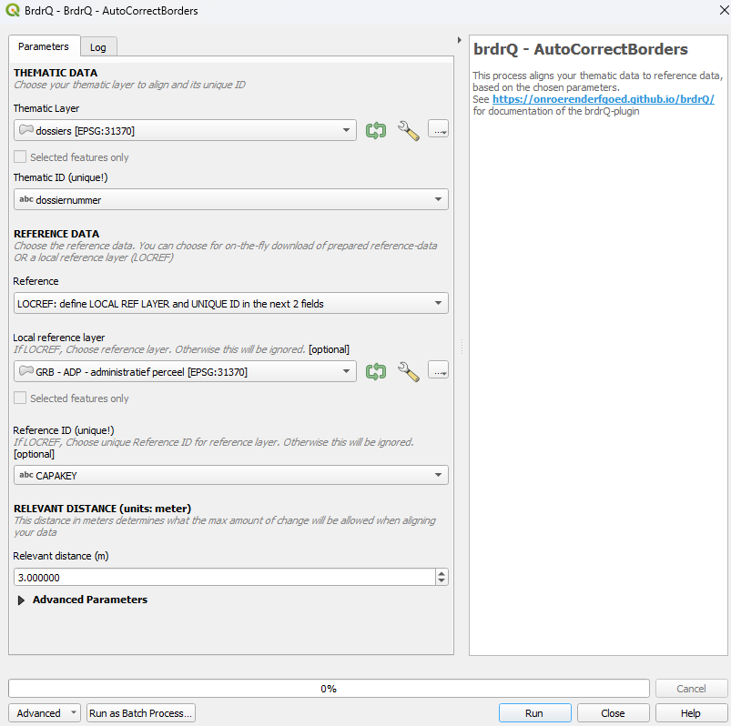
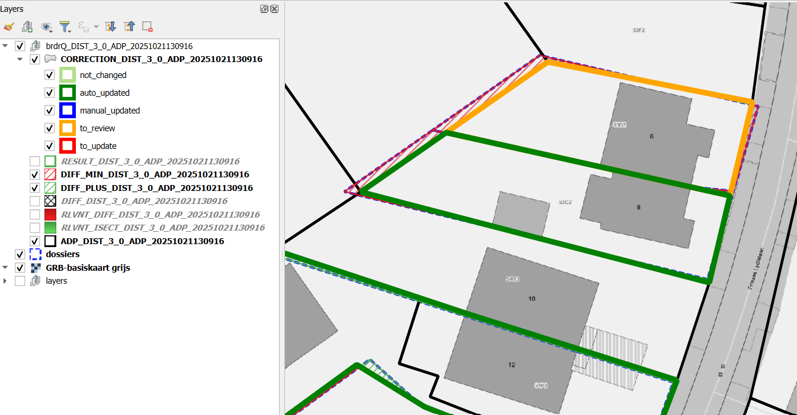

# Documentation of QGIS Python plugin brdrQ -  Autocorrectborders


## Video




## Description



The processing algorithm, named **Autocorrectborders**, is developed to automatically adjust thematic boundaries to
reference boundaries. It searches for relevant overlap between thematic boundaries and reference boundaries, and creates
a resulting boundary based on the relevant overlapping areas.

Because **Autocorrectborders** is exposed as a QGIS Processing algorithm, it is also available for use in the QGIS
Model Designer.

## Quick Start

1. Choose the thematic layer and a unique thematic ID.
2. Choose a reference source: `LOCREF` for a local reference layer, or an on-the-fly reference source.
3. Start conservatively with a limited `RELEVANT_DISTANCE`, for example `2-5` meters.
4. Decide how you want to use the output: use `RESULT_` and `DIFF_` directly, or enable the optional `CORRECTION_` review layer.
5. When you use the `CORRECTION_` workflow, open uncertain features in FeatureAligner and save a selected prediction where needed.

## Parameter Guide
Each parameter is documented once with the same structure: **Definition**, **Why use it**, **Choices**, and **Impact**.

### Thematic Layer
- **Definition**: Input vector layer (polygon, line, or point) in projected CRS (meters).
- **Why use it**: Defines the geometry that will be corrected.
- **Choices**: Any valid layer with stable geometry and valid CRS.
- **Impact**: Invalid CRS or mixed quality input causes unreliable alignment.

### Thematic ID
- **Definition**: Unique feature identifier in the thematic layer.
- **Why use it**: Keeps feature lineage and output traceable.
- **Choices**: Text or numeric field with unique values.
- **Impact**: Non-unique IDs can break one-to-one interpretation of results.

### Reference / Local reference layer / Reference ID (unique!)
- **Definition**: Reference source selection (LOCREF or GRB on-the-fly) + reference ID field.
- **Why use it**: Determines geometric truth for snapping/alignment.
- **Choices**: Local reference for large/stable workflows; GRB for direct service-based reference.
- **Impact**: Better reference quality directly improves output quality.

### Relevant Distance (meters)
- **Definition**: Maximum allowed geometry shift.
- **Why use it**: Controls how far features may move to match reference.
- **Choices**: Low (1-2), medium (3-5), high (>10) depending on source quality.
- **Impact**: Lower values are conservative/faster; higher values are stronger/slower and may increase review cases.

### Use predictions
- **Definition**: Controls whether brdrQ performs one quick calculation at the requested distance, or evaluates multiple candidate predictions across a distance range.
- **Why use it**: `PREDICTIONS` helps find and evaluate more stable candidates in ambiguous situations.
- **Choices**: `NO_PREDICTIONS` for a quick calculation at the configured `RELEVANT_DISTANCE`; `PREDICTIONS` for a full scan over multiple distance steps.
- **Impact**: `PREDICTIONS` gives richer evaluation information and often better candidates, but increases processing time. With `NO_PREDICTIONS`, `brdr_evaluation` will usually remain `not_evaluated`.

### Prediction Strategy
- **Definition**: Output policy when multiple predictions exist.
- **Why use it**: Controls whether output is deterministic or review-oriented.
- **Choices**: BEST, ALL, ORIGINAL.
- **Impact**: BEST is production-friendly, ALL is analysis-heavy, ORIGINAL is safest under ambiguity.

### Full Reference Strategy
- **Definition**: Preference for predictions with full overlap to reference.
- **Why use it**: Enforces stricter geometric consistency when needed.
- **Choices**: `ONLY_FULL_REFERENCE`, `PREFER_FULL_REFERENCE`, `NO_FULL_REFERENCE`.
- **Impact**: Stricter modes reduce risky candidates but may omit usable alternatives.

### Processor
- **Definition**: Geometry processing engine selector.
- **Why use it**: Optimizes runtime and robustness per geometry type.
- **Choices**: `AlignerGeometryProcessor`, `NetworkGeometryProcessor`, `SnapGeometryProcessor`.
- **Impact**: Correct processor choice improves speed and stability.

### Open Domain Strategy
- **Definition**: Behavior for geometry parts not covered by reference (Open Domain).
- **Why use it**: Aligns output with legal/operational boundary policy.
- **Choices**: EXCLUDE, ASIS, SNAP_INNER_SIDE, SNAP_ALL_SIDE.
- **Impact**: Changes whether and how non-reference-covered areas are retained.

### Snap Strategy
- **Definition**: Vertex snapping policy (mainly line/point workflows).
- **Why use it**: Controls strictness of snapping to real reference vertices.
- **Choices**: `NO_PREFERENCE`, `PREFER_VERTICES`, `PREFER_ENDS_AND_ANGLES`, `ONLY_VERTICES`.
- **Impact**: Stricter snapping yields cleaner topology but fewer candidates.

### Threshold overlap percentage (%)
- **Definition**: Fallback overlap threshold for relevance decisions.
- **Why use it**: Resolves edge cases where relevance is unclear.
- **Choices**: 0-100 (default around 50).
- **Impact**: Higher values are stricter; lower values are more permissive.

### REVIEW_PERCENTAGE
- **Definition**: Threshold to classify results as `to_review`.
- **Why use it**: Controls QA workload.
- **Choices**: Lower for strict QA, higher for more automation.
- **Impact**: Lower threshold increases manual review volume.

### Generate CORRECTION Review/Workflow Layer
- **Definition**: Controls whether brdrQ creates an additional `CORRECTION_` layer with `brdrq_state`.
- **Why use it**: The layer supports a review workflow in QGIS and FeatureAligner.
- **Choices**: True when you want a review/work layer; False when `RESULT_` and `DIFF_` are sufficient.
- **Impact**: Disabling this keeps the output simpler. It does not change the calculated `RESULT_` or `DIFF_` layers.

### Work Folder
- **Definition**: Output/log storage location.
- **Why use it**: Ensures reproducible output organization.
- **Choices**: Empty (default local) or explicit path.
- **Impact**: Explicit folder simplifies batch audit and traceability.

### Show Intermediate processing results
- **Definition**: Adds intermediate layers for diagnostics.
- **Why use it**: Helps understand why alignment succeeded/failed.
- **Choices**: False/True.
- **Impact**: Better interpretability, slightly heavier output.

### Write extra logging (from brdr-log)
- **Definition**: Writes extended processing logs.
- **Why use it**: Troubleshooting and audit.
- **Choices**: False/True.
- **Impact**: Enables root-cause analysis at cost of larger logs.

## Recommended Presets
- **Fast Scan**: `PREDICTIONS=NO_PREDICTIONS`, `Relevant Distance=2-4`, `REVIEW_PERCENTAGE=10`.
- **Balanced Production**: `PREDICTIONS=PREDICTIONS`, `Prediction Strategy=BEST`, `Full Reference Strategy=PREFER_FULL_REFERENCE`, `Relevant Distance=3-5`.
- **Strict QA**: lower `REVIEW_PERCENTAGE` (`5-8`), conservative `Relevant Distance`, stricter full-reference mode.
- **Exploration**: `PREDICTIONS=PREDICTIONS`, `Prediction Strategy=ALL`, `SHOW_INTERMEDIATE_LAYERS=True`, `LOG_INFO=True`.
- **Direct Output Only**: `GENERATE_CORRECTION_LAYER=False` when your process consumes only `RESULT_` and `DIFF_` layers.

## Output Parameters

The script generates a group in the QGIS layer tree. Layer names get a suffix with this pattern: `_DIST_<relevant_distance>_<reference>_<timestamp>`. With `PREDICTIONS=PREDICTIONS`, `_PREDICTIONS` is appended.

The main output layers are:

* `RESULT_DIST_...`: resulting geometries after alignment.
* `DIFF_DIST_...`: differences (+ and -) between original and resulting geometry.
* `DIFF_MIN_DIST_...`: differences (-) between original and resulting geometry.
* `DIFF_PLUS_DIST_...`: differences (+) between original and resulting geometry.
* optional `RLVNT_DIFF_DIST_...`: relevant differences (parts to exclude), used when processing the resulting geometry.
* optional `RLVNT_ISECT_DIST_...`: relevant intersection (parts to include), used when processing the resulting geometry.
* optional `CORRECTION_DIST_...`: workflow layer copied from the thematic layer, with updated geometries and `brdrq_state` for review.

The `RESULT_` and `DIFF_` layers are the primary tool output. You can use them directly in your own workflow without doing anything with the `CORRECTION_` layer.

The `CORRECTION_` layer is only generated when `GENERATE_CORRECTION_LAYER=True` and the output represents one selected result per feature. When `PREDICTIONS=PREDICTIONS` is combined with `Prediction Strategy=ALL`, no `CORRECTION_` layer is generated because that setting is meant to analyze all candidate predictions.



## Workflow: Direct RESULT/DIFF Usage

Use this workflow when your process only needs the calculated geometry and the differences from the original input:

1. Run Autocorrectborders.
2. Use `RESULT_DIST_...` as the aligned geometry output.
3. Use `DIFF_DIST_...`, `DIFF_PLUS_DIST_...`, and `DIFF_MIN_DIST_...` for QA, reporting, or filtering.
4. Disable `GENERATE_CORRECTION_LAYER` when the extra review layer would only create noise in your project.

This is often the cleanest option for ETL, model builder, batch processing, or users who already have their own QA process.

## Workflow: Review With the CORRECTION Layer

Use this workflow when you want brdrQ to prepare a QGIS work layer for human review.

The `CORRECTION_DIST_...` layer contains a copy of the thematic layer, enriched with brdr/brdrQ fields. The original input layer is not modified.

`brdrq_state` is a brdrQ workflow status. It is not a quality score or evaluation score from the underlying brdr algorithm. Use this status to decide which features were handled automatically and which still need human attention.

| `brdrq_state` | Meaning | Typical action |
| :--- | :--- | :--- |
| `not_changed` | The feature is considered unchanged. This happens, for example, when brdr returns `no_change` or when the symmetrical difference is very small. | No action needed, except for optional sampling QA. |
| `auto_updated` | Autocorrectborders found a usable result and automatically wrote the calculated geometry into the `CORRECTION_` layer. | Review by sample or according to your QA procedure. |
| `to_review` | A result or proposal exists, but brdrQ marks the feature for review. This can happen because of multiple candidates for the same ID, a change percentage above `REVIEW_PERCENTAGE`, or a stable result that should not be accepted without review. | Open the feature in FeatureAligner and decide whether the proposed geometry is correct. |
| `to_update` | No automatically applicable result could be determined. The original geometry remains visible in the `CORRECTION_` layer and difference values are set to `-1`. | Handle the feature manually in FeatureAligner or QGIS. Use predictions as a starting point where available. |
| `manual_updated` | A user selected and saved a proposed geometry in FeatureAligner with `Save Geometry`. This status is not assigned by Autocorrectborders itself. | Treat as manually reviewed and updated. |
| `none` | Technical initial value before brdrQ assigns a workflow status. | Should normally not remain as final output. Check processing logs if it does. |

`brdr_evaluation` is different from `brdrq_state`. It comes from the brdr evaluation phase and describes how brdr categorizes a prediction. brdrQ then translates that evaluation into a practical workflow status in `brdrq_state`.

Possible values include:

| `brdr_evaluation` | Interpretation |
| :--- | :--- |
| `no_change` | brdr evaluates that the geometry does not need to change. |
| `prediction_unique`, `prediction_unique_full` | A unique candidate prediction was found; `full` indicates full reference overlap. |
| `equality_by_id`, `equality_by_full_reference`, `equality_by_id_and_full_reference` | brdr finds equality by ID, full reference overlap, or both. |
| `to_check_prediction_full`, `to_check_prediction_multi`, `to_check_prediction_multi_full` | Candidate predictions exist, but human review is needed. |
| `to_check_original`, `to_check_no_prediction` | The original geometry or the absence of a prediction needs review. |
| `not_evaluated` | No full evaluation phase was run, or no usable evaluation value is available. |

If you only see `not_evaluated`, that is usually expected when `PREDICTIONS=NO_PREDICTIONS`. Autocorrectborders then performs one quick calculation for the configured `RELEVANT_DISTANCE` and does not run the full evaluation and selection of all candidate predictions. Choose `PREDICTIONS=PREDICTIONS` if you need the brdr evaluations of candidate predictions.

## Use Outside QGIS, For Example FME

Autocorrectborders is a QGIS Processing algorithm around the Python library `brdr`. For FME, ETL pipelines, or other software, the recommended integration is to call `brdr` directly, for example from an FME PythonCaller or a custom transformer.

This avoids an unnecessary dependency on QGIS and brdrQ in automated data flows. The bulk logic of Autocorrectborders can be reproduced by calling `brdr` with the same conceptual parameters: thematic geometry, reference geometry, relevant distance, prediction settings, open-domain strategy, snap strategy, and evaluation strategy. brdrQ remains the ready-to-use QGIS interface and QGIS workflow for that functionality.

There is no separate brdrQ API that FME needs to call. If an API-based integration is required, it is best implemented as a lightweight service around `brdr` itself.

## Example of Usage

Here is an example of how to use the script in Python:

```python

params = {
                "INPUT_THEMATIC": themelayername,
                "COMBOBOX_ID_THEME": "theme_identifier",
                "RELEVANT_DISTANCE": 2,
                "ENUM_REFERENCE": 1,
                "INPUT_REFERENCE": None,
                "COMBOBOX_ID_REFERENCE": None,
                "WORK_FOLDER": 'brdrq',
                "ENUM_OD_STRATEGY": 1,
                "ENUM_SNAP_STRATEGY": 1,
                "ENUM_PROCESSOR": 0,
                "THRESHOLD_OVERLAP_PERCENTAGE": 50,
                  "PREDICTIONS": 0,
                "FULL_REFERENCE_STRATEGY": 2,
                "PREDICTION_STRATEGY": 0,
                "REVIEW_PERCENTAGE": 10,
                "GENERATE_CORRECTION_LAYER": True,
                "ADD_METADATA": True,
                "ADD_ATTRIBUTES": True,
                "SHOW_INTERMEDIATE_LAYERS": True,
                "LOG_INFO": False,
            }

processing.run('brdrqprovider:brdrqautocorrectborders', params)

```

## TIPS

- Set PREDICTIONS for the best results. This will analyse the full range of
  RELEVANT_DISTANCES (FULL SCAN), and returns the best stable results. A side-effect is that the processing-time is much
  slower. By default this parameter is set to False to have quicker results (QUICK SCAN), missing the better results.

- Analyse your thematic dataset and try to gain insight into the 'deviation' (precision and accuracy from the reference
  layer):
    - Where does the thematic data come from?
    - when was it created,
    - on what reference limits was it drawn at the time,
    - Which drawing rules have been applied (e.g. accuracy of 0.5m)
    - ...

This allows you to gain insight into the 'deviation' and which RELEVANT_DISTANCE value can best be applied.

- The current version of the script assumes that both the thematic layer and reference layer are in the same projected
  CRS with units in meter.
- Thematic boundaries consisting of 1 or a few reference polygons are processed by the script in a few seconds. If the
  thematic boundaries cover a very large area (~1000 and reference polygons), it may take several minutes for the OUTPUT
  to be calculated. It's best to let QGIS finish this processing before proceeding
- In practice, we notice that large thematic demarcations are sometimes drawn more roughly (less precisely or
  inaccurately), so that a high RELEVANT DISTANCE is required to shift them to the reference file. For large areas that
  are drawn 'roughly', it is best to use a high RELEVANT_DISTANCE (e.g. >10 meters) and:
    - OD-strategy EXCLUDE: if you want to completely exclude all public domain
    - OD-strategy AS_IS: if you want to include all the covered public domain AS IS in the result
    - OD strategy SNAP_INNER_SIDE: if you want to keep the public domain within the demarcation, but move the edges to
      the inner side of the thematic polygon
    - OD strategy SNAP_ALL_SIDE: if you want to keep the public domain within the demarcation, but move the edges to
      the inner & outer side of the thematic polygon


## OUTPUT - FIELDS

This sections lists fieldnames that can be found in the output layer and explains what this field is about.

| Attribute | Type | Description |
| :--- | :--- | :--- |
| **brdr_id** | Integer | Internal unique identifier for the processed feature. |
| **brdr_area** | Double | The calculated area of the resulting geometry ($m^2$). |
| **brdr_perimeter** | Double | The total length of the boundary of the resulting geometry ($m$). |
| **brdr_shape_index** | Double | A complexity metric of the shape (e.g., compactness ratio). |
| **brdr_stability** | Boolean | Indicates if the geometry remains stable across multiple calculation iterations. |
| **brdr_prediction_score** | Double | Confidence score (%) of the alignment prediction. |
| **brdr_prediction_count** | Integer | Number of candidate matches found for the alignment. |
| **brdr_evaluation** | String | Categorization of the result (e.g., `prediction_unique`, `to_check_prediction_multi`). |
| **brdrq_state** | String | brdrQ workflow status in the optional `CORRECTION_` layer: `not_changed`, `auto_updated`, `to_review`, `to_update`, `manual_updated`, or `none`. |
| **brdrq_original_wkt** | String | WKT of the original geometry before the optional correction layer was updated. Used for review and reset workflows. |
| **brdr_relevant_distance** | Double | The buffer or search distance used during the alignment procedure ($m$). |
| **brdr_sym_diff_area_index** | Double | The absolute area of the symmetrical difference between base and target ($m^2$). |
| **brdr_sym_diff_area_index_perc** | Double | The symmetrical difference expressed as a percentage of the total area. |
| **brdr_diff_area_index** | Double | The absolute area difference between input and output geometries ($m^2$). |
| **brdr_diff_length_index** | Double | The absolute difference in boundary length ($m$). |
| **brdr_full_actual** | Boolean | Flag indicating if the alignment covers the full extent of the actual feature. |
| **brdr_remark** | String | Automated logs or warnings generated during the geometry processing. |
| **brdr_metadata** | JSON/Object | Embedded SOSA/SSN metadata containing the lineage, sensors, and procedures used. |


