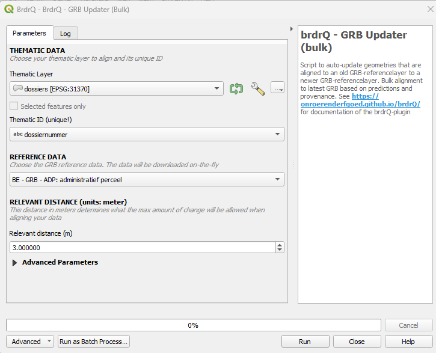

# Documentation of QGIS Python plugin brdrQ -  AutoUpdateBorders - GRB Updater (Flanders-specific dataset)



## Description

`AutoUpdateBorders` is a QGIS-processing Script to auto-update geometries that are aligned to an old GRB-referencelayer (Flanders)
to a newer GRB-referencelayer. It makes predictions to find the resulting aligned geometry. If multiple predictions are
found the user can choose to return ALL predictions, the BEST prediction, or the ORIGINAL geometry (for further
analysis).

## Parameter Guide

### Thematic Layer
- **Definition**: Input geometry layer to be temporally updated.
- **Why use it**: Defines which existing aligned features will be migrated to newer GRB geometry.
- **Choices**: Projected CRS layer with stable geometry.
- **Impact**: Bad source quality propagates into update uncertainty.

### Thematic ID
- **Definition**: Unique feature key.
- **Why use it**: Maintains stable lineage over update cycles.
- **Choices**: Unique text/numeric field.
- **Impact**: Non-unique IDs reduce traceability and review clarity.

### Reference Layer
- **Definition**: GRB source selection (ADP, GBG, KNW).
- **Why use it**: Picks the target dataset type for update.
- **Choices**: Match source to domain object type.
- **Impact**: Wrong reference type leads to semantically wrong updates.

### Relevant Distance (meters)
- **Definition**: Maximum search shift for update candidates.
- **Why use it**: Limits update aggressiveness.
- **Choices**: 3-5 typical; higher for rough legacy datasets.
- **Impact**: Higher distance finds more candidates but increases ambiguity.

### PREDICTION_STRATEGY
- **Definition**: Policy when multiple candidate updates exist.
- **Why use it**: Controls determinism vs analysis.
- **Choices**: BEST, ALL, ORIGINAL.
- **Impact**: BEST is production default; ALL increases review scope; ORIGINAL is safe fallback.

### FULL_REFERENCE_STRATEGY
- **Definition**: Preference strength for full-reference-overlap candidates.
- **Why use it**: Enforces stricter topological confidence.
- **Choices**: ONLY_FULL, PREFER_FULL, NO_FULL.
- **Impact**: Stricter settings reduce risky updates but may hide alternatives.

### ENUM_OD_STRATEGY
- **Definition**: Open Domain behavior outside reference coverage.
- **Why use it**: Aligns result with policy on non-covered areas.
- **Choices**: Strategy enum options.
- **Impact**: Changes boundary inclusion/exclusion semantics.

### ENUM_SNAP_STRATEGY
- **Definition**: Snap strictness to reference vertices.
- **Why use it**: Controls structural fit in line/point situations.
- **Choices**: NO_PREFERENCE, PREFER_VERTICES, ONLY_VERTICES.
- **Impact**: Stricter settings improve vertex correctness but reduce flexibility.

### ENUM_PROCESSOR
- **Definition**: Processing backend selector.
- **Why use it**: Runtime/performance optimization.
- **Choices**: Prefer AlignerGeometryProcessor.
- **Impact**: Better defaults reduce runtime variance.

### THRESHOLD_OVERLAP_PERCENTAGE
- **Definition**: Fallback overlap threshold for edge-case relevance.
- **Why use it**: Stabilizes ambiguous relevance decisions.
- **Choices**: 0-100.
- **Impact**: Higher threshold = stricter acceptance.

### REVIEW_PERCENTAGE
- **Definition**: Change threshold for review categorization.
- **Why use it**: Tunes QA load.
- **Choices**: Lower for strict control, higher for throughput.
- **Impact**: Directly changes number of records to review.

### WORKING FOLDER
- **Definition**: Output folder for generated artifacts.
- **Why use it**: Centralized run outputs/logs.
- **Choices**: default local or explicit directory.
- **Impact**: Improves reproducibility and auditability.

### METADATA_FIELD
- **Definition**: Field containing prior `brdr_metadata`.
- **Why use it**: Provides temporal lineage context.
- **Choices**: empty or existing metadata field.
- **Impact**: Can improve prediction quality.

### LOG_INFO
- **Definition**: Extended log output.
- **Why use it**: Diagnostics and troubleshooting.
- **Choices**: False/True.
- **Impact**: Better debugging, more log volume.

## Recommended Presets
- **Stable Production Update**: PREDICTION_STRATEGY=BEST, FULL_REFERENCE_STRATEGY=PREFER_FULL, Relevant Distance=3-5.
- **Strict Legal/Boundary QA**: FULL_REFERENCE_STRATEGY=ONLY_FULL, lower REVIEW_PERCENTAGE, conservative distance.
- **Ambiguity Analysis**: PREDICTION_STRATEGY=ALL, higher distance, LOG_INFO=True.
- **Safe Fallback**: PREDICTION_STRATEGY=ORIGINAL when preserving source geometry is preferred over uncertain shifts.


### Output Parameters

The script generates several output layers in the layer overview, combined into a group layer:

* brdrQ_RESULT: resulting geometries after alignment
* brdrQ_DIFF: differences (+ and -) between original and resulting geometry
* brdrQ_DIFF_PLUS: differences (+) between original and resulting geometry
* brdrQ_DIFF_MIN: differences (-) between original and resulting geometry

## Example of Usage

Here is an example of how to use the script in Python:

```python

output = processing.run(
    "brdrqprovider:brdrqautoupdateborders",
    {
        "INPUT_THEMATIC": themelayername,
        "COMBOBOX_ID_THEME": "theme_identifier",
        "ENUM_REFERENCE": 0,
        "METADATA_FIELD": "",
        "RELEVANT_DISTANCE": 5,
        "WORK_FOLDER": "",
        "ENUM_OD_STRATEGY": 2,
        "ENUM_SNAP_STRATEGY": 1,
        "ENUM_PROCESSOR": 0,
        "THRESHOLD_OVERLAP_PERCENTAGE": 50,
        "REVIEW_PERCENTAGE": 10,
        "PREDICTION_STRATEGY": 2,
        "FULL_REFERENCE_STRATEGY": 2,
        "LOG_INFO": True,
    },
)


```


