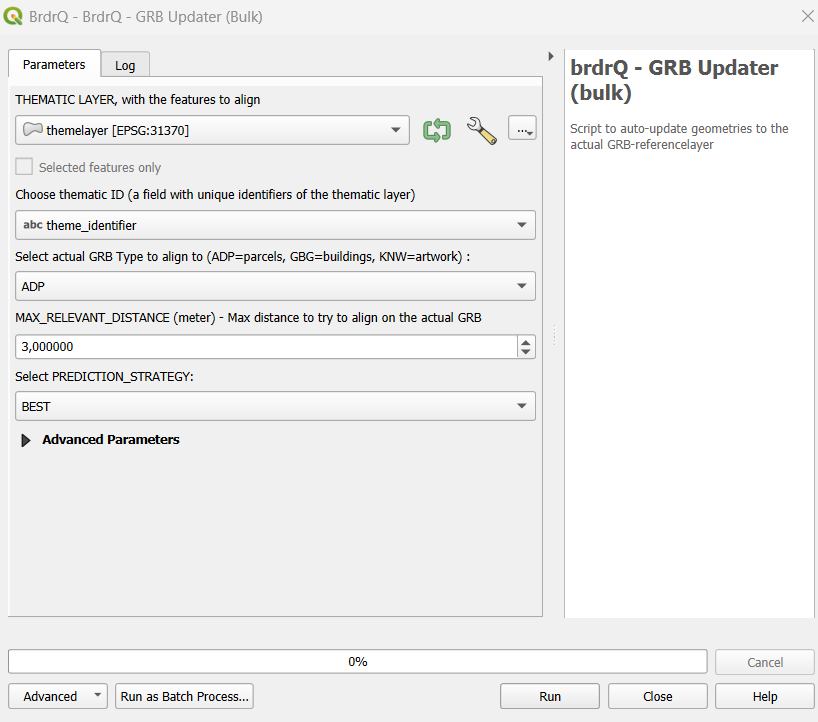

# Documentation of QGIS Python Script: AutoUpdateBorders



## Description

`AutoUpdateBorders` is a QGIS-processing Script to auto-update geometries that are aligned to an old GRB-referencelayer
to a newer GRB-referencelayer. It makes predictions to find the resulting aligned geometry. If multiple predictions are
found the user can choose to return ALL predictions, the BEST prediction, or the ORIGINAL geometry (for further
analysis).

## Parameters

### Input Parameters

- **Thematic Layer**: A (MULTI)POLYGON layer with EPSG:31370 or EPSG:3812 coordinates and a unique ID.
    - **Default**: No default value, must be provided by the user.
    - **Optional**: No.

- **Thematic ID**: Textual or numeric ID of the thematic layer used as a reference to the objects. This must be unique.

    - **Default**: No default value, must be provided by the user.
    - **Optional**: No.

- **Reference Layer**: A (MULTI)POLYGON layer with EPSG:31370 or EPSG:3812 coordinates. Combobox to choose which
  referencelayer will be used. There is a choice between on-the-fly
  downloadable referencelayers from GRB, or to use your own local REFERENCELAYER.
    - The local referencelayer and unique reference ID has to be choosen from the TOC:
    - The on-the-fly downloads are only
      possible for smaller areas.

        - ADP: (on-the-fly download) - Actual administrative parcels from GRB (Grootschalig Referentie Bestand)
        - GBG: (on-the-fly download) - Actual buildings from GRB
        - KNW: (on-the-fly download) - Actual artwork from GRB
        - (Note: the on-the-fly downloads are only possible for a subset or small area of thematic objects as this
          results in downloading this reference-area. When using brdrQ for bigger areas a local reference layer is necessary)

    - **Default**: ADP (parcels)
    - **Optional**: no


- **Max Relevant Distance (meters)**: Positive (decimal) number in meters. This is the maximum distance by which the original boundary is maximally shifted to align with the reference layer when searching for predictions. The algorithm uses all relevent distances from 0 to 'max' with steps of 10cm in between.
  - **Default**: 3 (meters)
  - **Optional**: No.


- **PREDICTION_STRATEGY** : Strategy when multiple predictions are available:

    - ALL: All predictions will be added to the result. It is not guaranteed anymore that the ID is unique anymore in
      the result.
    - BEST: Only the prediction with the best prediction_score will be added to the result (ID is unique)
    - ORIGINAL: When multiple predictions are found, the original geometry will be added to the result . The ID stays
      unique. This strategy can be usefull in combination with the featurealigner, so the multiple predictions can be
      handled one-by-one.

    - **Default**: BEST
    - **Optional**: No.

### ADVANCED INPUT PARAMETERS

- **FULL Strategy** Choice that determines the score of the predictions based on a full overlap with reference polygons:
    - ONLY_FULL: Only predictions with a full reference overlap are shown.
    - PREFER_FULL: Predictions with a full reference overlap get a higher score, others are still shown.
    - NO_FULL: No distinction is made between predictions with or without full reference overlap.
    - **Default**: None
    - **Optional**: yes.

Evaluation Strategy FULL: Choice that determines the score of the predictions based on a full overlap with reference
polygons:

- **WORKING FOLDER**: Folder to save the resulting geojson-files. By default empty, resulting in saving the
  geojson-files in
  a default folder on your machine.
    - **Default**: By default, the output will be saved in a local folder on your machine.
    - **Optional**: yes.

- **brdr_formula_field** Attribute-field of the thematic layer with a former brdr_formula.(=metadata of former
  alignment). When this information is provided it is used to make a better prediction.
    - **Default**: None
    - **Optional**: yes.

- **SHOW_LOG_INFO** (default False): When True, the logging of brdr is shown in the feedback-window
    - **Default**: False
    - **Optional**: No.

### Output Parameters

The script generates several output layers in the layer overview, combined into a group layer:

* brdrQ_RESULT: resulting geometries after alignment
* brdrQ_DIFF: differences (+ and -) between original and resulting geometry
* brdrQ_DIFF_PLUS: differences (+) between original and resulting geometry
* brdrQ_DIFF_MIN: differences (-) between original and resulting geometry

## Example of Usage

Here is an example of how to use the script in Python:

```python

output = processing.run(
    "brdrqprovider:brdrqautoupdateborders",
    {
        "INPUT_THEMATIC": themelayername,
        "COMBOBOX_ID_THEME": "theme_identifier",
        "ENUM_REFERENCE": 0,
        "FORMULA_FIELD": "",
        "MAX_RELEVANT_DISTANCE": 5,
        "WORK_FOLDER": "",
        "PREDICTION_STRATEGY": 2,
        "FULL_STRATEGY": 2,
        "SHOW_LOG_INFO": True,
    },
)


```


