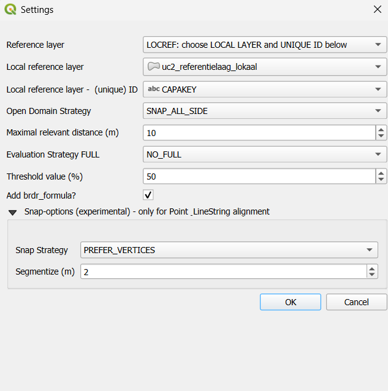

# Documentation of QGIS Python plugin brdrQ: FeatureAligner

## Instructions
0. Choose the settings for the alignment (reference layer,...)
1. Select the thematic layer you want to align.
2. Select a feature from the list or via 'Select feature(s) on map'.
3. View the prediction(s) for this aligned feature.

Additionally, you can:

* Switch between multiple predictions (via list, slider, or spinbox).
* Plot: Request a 'plot' of these predictions (relevant distance (m) vs. change (m²)).
* Visualize: Visualize the predicted relevant distances side by side.
* Save Geometry: Adjust the original geometry to the chosen prediction.
* Reset Geometry: Reset the original geometry (only within a feature session, so if no other feature is selected).

## Settings

* Choice of the **reference layer**: you can choose a local layer or several predefined on-the-fly layers (GRB, OSM,...)
* **OpenDomain Strategy**: exclude or include the Open Domain
* **Processor**: Choice of processing-algorithm. Best to use AlignerGeometryProcessor (default), as this is a wrapper that chooses the fastest available algorithm based on geometry-types: DieussaertGeometryProcessor for Polygon-to-Polygon and NetworkGeometryProcessor for all other geometry-type-combinations.
* **Threshold_overlap_percentage** (default 50): fallback value for the algorithm if no relevant areas are detected.
* **Maximum relevant distance**: Maximum distance (in meters) that can be used to search for predictions. (Prediction deviates at most by this value from the original).
* **Add metadata**: A field 'brdr_metadata' with descriptive metadata of the geometry is added to the result.
* **FullReference Strategy**: Choice that determines the score of the predictions based on a full overlap with reference polygons:
    * ONLY_FULL_REFERENCE: Only predictions with a full reference overlap are shown.
    * PREFER_FULL_REFERENCE: Predictions with a full reference overlap get a higher score, others are still shown.
    * NO_FULL_REFERENCE: No distinction is made between predictions with or without full reference overlap.
* SNAP OPTIONS: only used when geometry is processed by the NetworkGeometryAligner (Line or Points):
  * **SnapStrategy**:
    * NO_PREFERENCE: does not prefer real vertices when searching for a solution
    * PREFER_VERTICES: tries to move the result to real vertices of the reference data if they are within relevant distance
    * ONLY_VERTICES: uses only real vertices of the reference data (or not, if not found)
  * Segmentize: <No effect, can be ignored>

