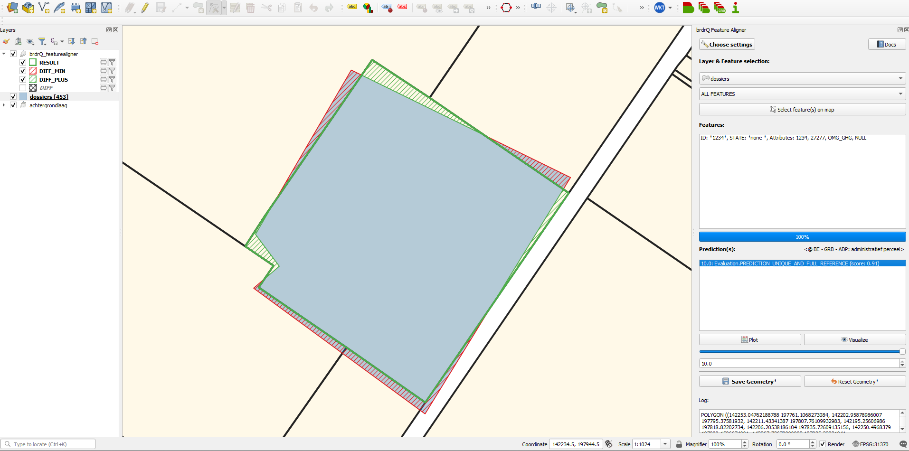


# Documentation of QGIS Python plugin brdrQ: FeatureAligner

## Video



## Instructions

0. Choose the settings for the alignment (reference layer,...)
1. Select the thematic layer you want to align.
2. Select a feature from the list or via 'Select feature(s) on map'.
3. View the prediction(s) for this aligned feature.

Additionally, you can:

* Switch between multiple predictions (via list, slider, or spinbox).
* Plot: Request a 'plot' of these predictions (relevant distance (m) vs. change (m²)).
* Visualize: Visualize the predicted relevant distances side by side.
* Save Geometry: Adjust the original geometry to the chosen prediction.
* Reset Geometry: Reset the original geometry (only within a feature session, so if no other feature is selected).

## Parameter Guide

### Reference layer
- **Definition**: Target dataset used as geometric truth.
- **Why use it**: Determines what ?aligned? means.
- **Choices**: Local/project reference or on-the-fly sources.
- **Impact**: Reference quality controls final alignment quality.

### Open Domain Strategy
- **Definition**: Handling rule for geometry parts outside reference coverage.
- **Why use it**: Reflects policy on non-covered area retention.
- **Choices**: Exclude/keep/snap variants.
- **Impact**: Changes whether external areas are removed, kept, or reshaped.

### Processor
- **Definition**: Algorithm backend selector.
- **Why use it**: Optimizes runtime by geometry type.
- **Choices**: AlignerGeometryProcessor recommended.
- **Impact**: Better defaults improve speed and consistency.

### Threshold value (%)
- **Definition**: Fallback threshold in uncertain relevance cases.
- **Why use it**: Prevents unstable candidate acceptance.
- **Choices**: usually around 50, adapt per dataset.
- **Impact**: Higher means stricter matching.

### Maximal relevant distance (m)
- **Definition**: Maximum deviation searched for predictions.
- **Why use it**: Controls correction aggressiveness.
- **Choices**: low/medium/high according to data drift.
- **Impact**: Larger values increase candidate range and ambiguity.

### Add brdr_metadata?
- **Definition**: Adds rdr_metadata to results.
- **Why use it**: Preserves lineage for downstream updates/audits.
- **Choices**: enabled/disabled.
- **Impact**: Better traceability with small storage overhead.

### Full Reference Strategy
- **Definition**: Preference for full-overlap candidates.
- **Why use it**: Raise confidence in selected predictions.
- **Choices**: ONLY_FULL_REFERENCE, PREFER_FULL_REFERENCE, NO_FULL_REFERENCE.
- **Impact**: Stricter mode improves certainty but may reduce alternatives.

### Snap Strategy
- **Definition**: Snap strictness to reference vertices (mainly line/point workflows).
- **Why use it**: Controls structural precision at vertices/endpoints.
- **Choices**: NO_PREFERENCE, PREFER_VERTICES, PREFER_ENDS_AND_ANGLES, ONLY_VERTICES.
- **Impact**: Stricter snapping improves topological control but can reduce feasible matches.

## Recommended Presets
- **Conservative Editing**: low distance + PREFER_FULL_REFERENCE.
- **Balanced Daily Use**: medium distance + default processor + PREFER_VERTICES.
- **Strong Recovery for Rough Data**: higher distance + permissive full-reference mode.
- **Strict Network Snapping**: ONLY_VERTICES + low distance.

