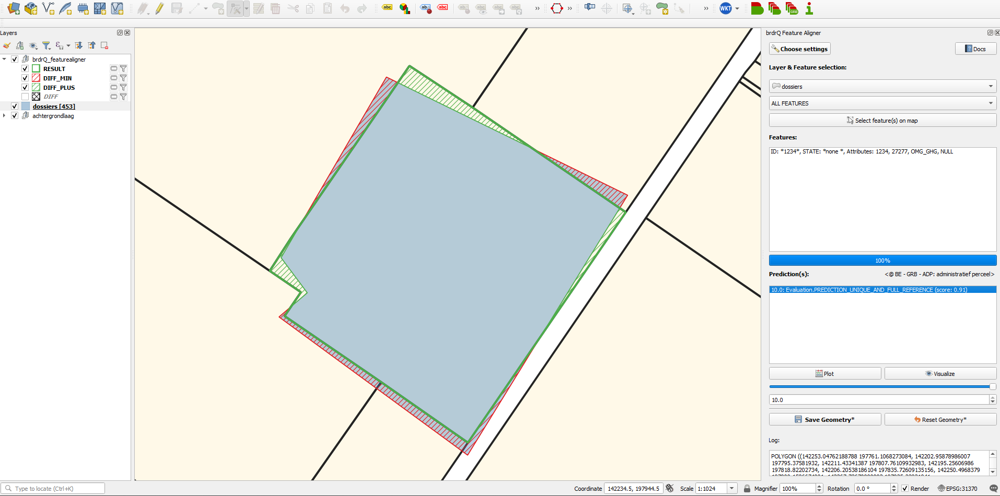

# Documentation of QGIS Python plugin brdrQ: FeatureAligner

## Video



## Instructions

## Quick Start

0. Choose the alignment settings, such as reference layer and strategies.
1. Select the thematic layer you want to align.
2. Select a feature from the list or via `Select feature(s) on map`.
3. View the prediction(s) for this feature.
4. Choose the prediction that best matches your interpretation.
5. Use `Save Geometry` only when you want to write the selected prediction to the selected layer.

Additionally, you can:

* Switch between multiple predictions via list, slider, or spinbox.
* Plot the predictions as relevant distance (m) versus change (m^2).
* Visualize predicted relevant distances side by side.
* Use `Reset Geometry` to reset the geometry within the current feature session.

FeatureAligner can be used on any editable thematic layer when you want to inspect predictions feature by feature. When it is used on a `CORRECTION_` layer from Autocorrectborders, it also updates the brdrQ workflow status:

* `Save Geometry` sets `brdrq_state` to `manual_updated`, because a user explicitly selected and saved a predicted geometry.
* `Reset Geometry` sets `brdrq_state` back to `to_update`, because the feature needs manual handling or review again.

## Parameter Guide

### Reference Layer
- **Definition**: Target dataset used as geometric truth.
- **Why use it**: Determines what `aligned` means in your project.
- **Choices**: Local/project reference or on-the-fly sources.
- **Impact**: Reference quality controls final alignment quality.

### Open Domain Strategy
- **Definition**: Handling rule for geometry parts outside reference coverage.
- **Why use it**: Reflects policy on non-covered area retention.
- **Choices**: `EXCLUDE`, `ASIS`, `SNAP_INNER_SIDE`, `SNAP_ALL_SIDE`.
- **Impact**: Changes whether external areas are removed, kept, or reshaped.

### Processor
- **Definition**: Algorithm backend selector.
- **Why use it**: Optimizes runtime by geometry type.
- **Choices**: `AlignerGeometryProcessor`, `NetworkGeometryProcessor`, `SnapGeometryProcessor`.
- **Impact**: Better defaults improve speed and consistency.

### Threshold Overlap Percentage (%)
- **Definition**: Fallback threshold in uncertain relevance cases.
- **Why use it**: Prevents unstable candidate acceptance.
- **Choices**: `0-100`, often around `50`.
- **Impact**: Higher values make relevance decisions stricter.

### Maximal Relevant Distance (m)
- **Definition**: Maximum distance searched for predictions.
- **Why use it**: Controls how far a geometry may move.
- **Choices**: low (`1-2`), medium (`3-5`), high (`>10`) according to data quality.
- **Impact**: Larger values increase candidate range and ambiguity.

### Add brdr_metadata?
- **Definition**: Adds `brdr_metadata` to results.
- **Why use it**: Preserves lineage for downstream updates and audits.
- **Choices**: enabled or disabled.
- **Impact**: Better traceability with small storage overhead.

### Full Reference Strategy
- **Definition**: Preference for candidates with full reference overlap.
- **Why use it**: Raises confidence in selected predictions.
- **Choices**: `ONLY_FULL_REFERENCE`, `PREFER_FULL_REFERENCE`, `NO_FULL_REFERENCE`.
- **Impact**: Stricter modes improve certainty but may reduce alternatives.

### Snap Strategy
- **Definition**: Snap strictness to reference vertices, mainly for line/point workflows.
- **Why use it**: Controls structural precision at vertices and endpoints.
- **Choices**: `NO_PREFERENCE`, `PREFER_VERTICES`, `PREFER_ENDS_AND_ANGLES`, `ONLY_VERTICES`.
- **Impact**: Stricter snapping improves topological control but can reduce feasible matches.

## Recommended Presets

- **Conservative editing**: low distance + `PREFER_FULL_REFERENCE`.
- **Balanced daily use**: medium distance + `AlignerGeometryProcessor` + `PREFER_VERTICES`.
- **Strong recovery for rough data**: higher distance + permissive full-reference mode.
- **Strict network snapping**: `ONLY_VERTICES` + low distance.
