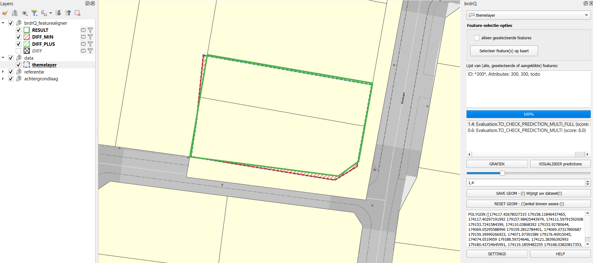

# Documentation of QGIS Python plugin: FeatureAligner

## Instructions
1. Select the thematic layer you want to align.
2. Select a feature from the list or via 'Select feature on map'.
3. View the prediction(s) for this aligned feature.

Additionally, you can:
* Switch between multiple predictions (via list, slider, or spinbox).
* Request a brdr-chart of these features (relevant distance (m) vs. change (m²)).
* Visualize the predicted relevant distances side by side.
* Adjust the original geometry to the chosen prediction.
* Reset the original geometry (only within a feature session, so if no other feature is selected).

## Settings
* Choice of the reference layer you want to align to (default ADP - current GRB parcels).
* Choice of 'Public Domain' Strategy (exclude or include the Public Domain).
* Threshold_overlap_percentage (default 50): fallback value for the algorithm if no relevant areas are detected.
* Maximum relevant distance: Maximum distance (in meters) that can be used to search for predictions. (Prediction deviates at most by this value from the original).
* Add brdr_formula: A field with a descriptive formula of the geometry is added to the result.
* Evaluation Strategy FULL: Choice that determines the score of the predictions based on a full overlap with reference polygons:
    * ONLY_FULL: Only predictions with a full reference overlap are shown.
    * PREFER_FULL: Predictions with a full reference overlap get a higher score, others are still shown.
    * NO_FULL: No distinction is made between predictions with or without full reference overlap.

