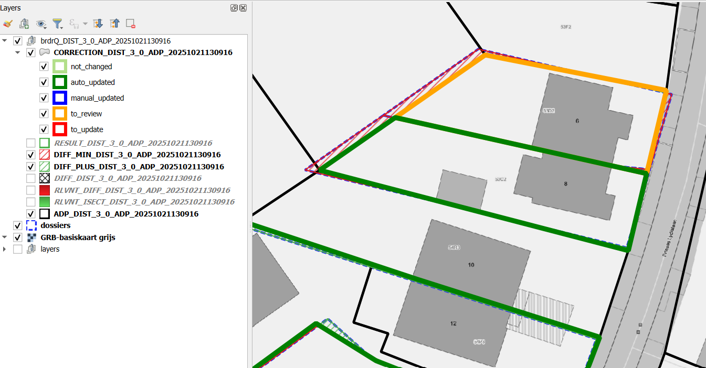

---
title: "Autocorrectborders (BULK)"
lang: nl
---

# Documentatie van QGIS Python-plugin brdrQ - Autocorrectborders

## Video



## Beschrijving


Het processing-algoritme **Autocorrectborders** is ontwikkeld om thematische grenzen automatisch aan te passen aan referentiegrenzen. Het zoekt relevante overlap tussen thematische grenzen en referentiegrenzen en maakt op basis daarvan een resulterende grens.

## Parametergids
Elke parameter wordt eenduidig uitgelegd met: **Definitie**, **Waarom gebruiken**, **Mogelijke keuzes**, en **Gevolg**.

### Thematic Layer
- **Definitie**: Invoer-vectorlaag (polygoon, lijn of punt) in geprojecteerde CRS (meter).
- **Waarom gebruiken**: Bepaalt welke geometrie gecorrigeerd wordt.
- **Mogelijke keuzes**: Elke geldige laag met stabiele geometrie en geldige CRS.
- **Gevolg**: Ongeldige CRS of gemengde inputkwaliteit geeft onbetrouwbare uitlijning.

### Thematic ID
- **Definitie**: Unieke identifier van een feature in de thematische laag.
- **Waarom gebruiken**: Houdt herkomst en resultaten eenduidig traceerbaar.
- **Mogelijke keuzes**: Tekst- of numeriek veld met unieke waarden.
- **Gevolg**: Niet-unieke IDs maken interpretatie en review foutgevoeliger.

### Reference / Local reference layer / Reference ID (unique!)
- **Definitie**: Keuze van referentiebron (LOCREF of GRB on-the-fly) plus bijhorend referentie-ID-veld.
- **Waarom gebruiken**: Bepaalt de geometrische waarheid voor uitlijning.
- **Mogelijke keuzes**: Lokale referentie voor gecontroleerde workflows; GRB voor service-gebaseerde referentie.
- **Gevolg**: Betere referentie = betere outputkwaliteit.

### Relevant Distance (meters)
- **Definitie**: Maximum allowed geometry shift.
- **Waarom gebruiken**: Stuurt hoe ver features mogen verschuiven richting referentie.
- **Mogelijke keuzes**: Laag (`1-2`), midden (`3-5`), hoog (`>10`) afhankelijk van bronkwaliteit.
- **Gevolg**: Lage waarden zijn voorzichtiger/sneller; hoge waarden zijn krachtiger/trager en verhogen vaak review.

### Use predictions
- **Definitie**: Enables full-scan candidate search over distance steps.
- **Waarom gebruiken**: Vindt stabiele kandidaten in ambigue situaties.
- **Mogelijke keuzes**: False (quick scan) or True (full scan).
- **Gevolg**: `True` verhoogt kandidaatkwaliteit maar kost meer rekentijd.

### Prediction Strategy
- **Definitie**: Output policy when multiple predictions exist.
- **Waarom gebruiken**: Bepaalt of output deterministisch of analysegericht is.
- **Mogelijke keuzes**: BEST, ALL, ORIGINAL.
- **Gevolg**: `BEST` is productiegericht, `ALL` is analysegericht, `ORIGINAL` is de veiligste fallback.

### Full Reference Strategy
- **Definitie**: Preference for predictions with full overlap to reference.
- **Waarom gebruiken**: Verhoogt geometrische zekerheid indien gewenst.
- **Mogelijke keuzes**: `ONLY_FULL_REFERENCE`, `PREFER_FULL_REFERENCE`, `NO_FULL_REFERENCE`.
- **Gevolg**: Strikter verlaagt risico, maar kan bruikbare alternatieven uitsluiten.

### Processor
- **Definitie**: Geometry processing engine selector.
- **Waarom gebruiken**: Optimaliseert runtime en robuustheid per geometrietype.
- **Mogelijke keuzes**: Prefer AlignerGeometryProcessor.
- **Gevolg**: Juiste processor geeft betere snelheid en stabiliteit.

### Open Domain Strategy
- **Definitie**: Behavior for geometry parts not covered by reference (Open Domain).
- **Waarom gebruiken**: Stemt output af op inhoudelijk/operationeel grensbeleid.
- **Mogelijke keuzes**: EXCLUDE, ASIS, SNAP_INNER_SIDE, SNAP_ALL_SIDE.
- **Gevolg**: Bepaalt of en hoe niet-gedekte zones behouden of aangepast worden.

### Snap Strategy
- **Definitie**: Vertex snapping policy (mainly line/point workflows).
- **Waarom gebruiken**: Stuurt de strengheid van snapping naar echte referentievertices.
- **Mogelijke keuzes**: NO_PREFERENCE, PREFER_VERTICES, ONLY_VERTICES.
- **Gevolg**: Strikter geeft nettere topologie, maar vaak minder kandidaten.

### Threshold overlap percentage (%)
- **Definitie**: Fallback overlapdrempel voor relevantiebeslissingen.
- **Waarom gebruiken**: Lost randgevallen op waar relevantie onduidelijk is.
- **Mogelijke keuzes**: `0-100` (standaard vaak rond `50`).
- **Gevolg**: Hogere waarden zijn strenger, lagere waarden toleranter.

### REVIEW_PERCENTAGE
- **Definitie**: Drempel om resultaten als `to_review` te classificeren.
- **Waarom gebruiken**: Stuurt de QA-werklast.
- **Mogelijke keuzes**: Lager voor strikte QA, hoger voor meer automatisatie.
- **Gevolg**: Lagere drempel geeft meer manuele review.

### Work Folder
- **Definitie**: Locatie voor output en logbestanden.
- **Waarom gebruiken**: Zorgt voor reproduceerbare outputorganisatie.
- **Mogelijke keuzes**: Leeg (standaard lokaal) of expliciet pad.
- **Gevolg**: Expliciet pad vereenvoudigt batch-audit en traceerbaarheid.

### Show Intermediate processing results
- **Definitie**: Adds intermediate layers for diagnostics.
- **Waarom gebruiken**: Maakt duidelijk waarom uitlijning wel/niet slaagde.
- **Mogelijke keuzes**: False/True.
- **Gevolg**: Beter inzicht, met iets zwaardere output.

### Write extra logging (from brdr-log)
- **Definitie**: Writes extended processing logs.
- **Waarom gebruiken**: Troubleshooting en audit.
- **Mogelijke keuzes**: False/True.
- **Gevolg**: Meer diagnose-inzicht, met grotere logbestanden.

## Aanbevolen presets
- **Snelle scan**: PREDICTIONS=False, Relevant Distance=2-4, REVIEW_PERCENTAGE=10.
- **Gebalanceerde productie**: PREDICTIONS=True, Prediction Strategy=BEST, Full Reference Strategy=PREFER_FULL_REFERENCE, Relevant Distance=3-5.
- **Strikte QA**: lower REVIEW_PERCENTAGE (5-8), conservative Relevant Distance, stricter full-reference mode.
- **Verkenning**: PREDICTIONS=True, Prediction Strategy=ALL, SHOW_INTERMEDIATE_LAYERS=True, LOG_INFO=True.

## Uitvoerparameters

Het script genereert een GROUP-laag met meerdere outputlagen in de TOC:

* `CORRECTION_X_Y`: kopie van thematische laag met aangepaste geometrieen, opgesplitst per categorie (`brdrq_state`)
* `brdrQ_RESULT_X_Y`: resulterende geometrieen na uitlijning
* `brdrQ_DIFF_X_Y`: verschillen (+ en -) tussen origineel en resultaat
* `brdrQ_DIFF_MIN_X_Y`: verschillen (-) tussen origineel en resultaat
* `brdrQ_DIFF_PLUS_X_Y`: verschillen (+) tussen origineel en resultaat
* (optioneel) `brdrQ_RLVNT_DIFF_X_Y`: relevante verschillen (te verwijderen delen), gebruikt bij verwerken van resultaat
* (optioneel) `brdrQ_RLVNT_ISECT_X_Y`: relevante intersectie (op te nemen delen), gebruikt bij verwerken van resultaat

De naam bevat welke `RELEVANT_DISTANCE (X)` en `REFERENCE (Y)` gebruikt zijn.



## Voorbeeldgebruik

Voorbeeld van gebruik in Python:

```python
{
    "INPUT_THEMATIC": themelayername,
    "COMBOBOX_ID_THEME": "theme_identifier",
    "RELEVANT_DISTANCE": 2,
    "ENUM_REFERENCE": 1,
    "INPUT_REFERENCE": None,
    "COMBOBOX_ID_REFERENCE": None,
    "WORK_FOLDER": 'brdrq',
    "ENUM_OD_STRATEGY": 1,
    "ENUM_SNAP_STRATEGY": 1,
    "ENUM_PROCESSOR": 0,
    "THRESHOLD_OVERLAP_PERCENTAGE": 50,
    "PREDICTIONS": 0,
    "FULL_REFERENCE_STRATEGY": 2,
    "PREDICTION_STRATEGY": 0,
    "REVIEW_PERCENTAGE": 10,
    "ADD_METADATA": True,
    "ADD_ATTRIBUTES": True,
    "SHOW_INTERMEDIATE_LAYERS": True,
    "LOG_INFO": False,
}

processing.run('brdrqprovider:brdrqautocorrectborders', params)
```

## Tips

- Zet `PREDICTIONS` aan voor de beste resultaten. Dan wordt het volledige bereik van `RELEVANT_DISTANCE` geanalyseerd (FULL SCAN) en worden de beste stabiele resultaten gekozen. Nadeel: trager.

- Analyseer je thematische dataset en probeer inzicht te krijgen in de afwijking (precisie en accuratesse t.o.v. referentie):
  - Waar komt de thematische data vandaan?
  - Wanneer is ze aangemaakt?
  - Op basis van welke referentiegrenzen werd ze getekend?
  - Welke tekenregels/nauwkeurigheid werden toegepast (bv. 0.5 m)?

Dit helpt om een passende `RELEVANT_DISTANCE` te kiezen.

- De huidige versie van het script gaat ervan uit dat thematische laag en referentielaag in dezelfde geprojecteerde CRS staan met meter als eenheid.
- Thematische grenzen met 1 of enkele referentiepolygonen worden meestal in seconden verwerkt. Voor zeer grote gebieden (~1000+ referentiepolygonen) kan de berekening minuten duren.
- In de praktijk zijn grote afbakeningen soms ruwer getekend, waardoor een hogere `RELEVANT_DISTANCE` nodig is (bv. >10 m):
  - `OD-strategy EXCLUDE`: volledig open domein uitsluiten
  - `OD-strategy AS_IS`: bedekt open domein ongewijzigd meenemen
  - `OD-strategy SNAP_SINGLE_SIDE`: open domein behouden, randen naar binnenzijde verplaatsen
  - `OD-strategy SNAP_ALL_SIDE`: open domein behouden, randen naar binnen- en buitenzijde verplaatsen

## OUTPUT - VELDEN

Deze sectie geeft veldnamen van de outputlaag en hun betekenis.

| Attribuut | Type | Beschrijving |
| :--- | :--- | :--- |
| **brdr_id** | Integer | Interne unieke identificatie van de verwerkte feature. |
| **brdr_area** | Double | Berekende oppervlakte van de resulterende geometrie ($m^2$). |
| **brdr_perimeter** | Double | Totale grenslengte van de resulterende geometrie ($m$). |
| **brdr_shape_index** | Double | Complexiteitsmaat van de vorm (bv. compactheidsratio). |
| **brdr_stability** | Boolean | Geeft aan of geometrie stabiel blijft over meerdere berekeningen. |
| **brdr_prediction_score** | Double | Betrouwbaarheidsscore (%) van de uitlijningsvoorspelling. |
| **brdr_prediction_count** | Integer | Aantal kandidaatmatches gevonden voor de uitlijning. |
| **brdr_evaluation** | String | Categorie van het resultaat (bv. `prediction_unique`, `to_check_prediction_multi`). |
| **brdr_relevant_distance** | Double | Gebruikte buffer/zoekafstand tijdens uitlijning ($m$). |
| **brdr_sym_diff_area_index** | Double | Absolute oppervlakte van het symmetrisch verschil tussen basis en target ($m^2$). |
| **brdr_sym_diff_area_index_perc** | Double | Symmetrisch verschil uitgedrukt als percentage van totale oppervlakte. |
| **brdr_diff_area_index** | Double | Absolute oppervlakteverschil tussen input- en outputgeometrieen ($m^2$). |
| **brdr_diff_length_index** | Double | Absoluut verschil in grenslengte ($m$). |
| **brdr_full_actual** | Boolean | Vlag die aangeeft of uitlijning de volledige actuele feature dekt. |
| **brdr_remark** | String | Automatische logs of waarschuwingen uit geometrieverwerking. |
| **brdr_metadata** | JSON/Object | Ingesloten SOSA/SSN-metadata met lineage, sensoren en procedures. |


