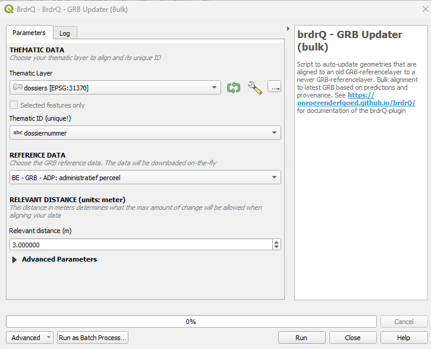

---
title: "GRB Updater (BULK)"
lang: nl
---

# Documentatie van QGIS Python-plugin brdrQ - AutoUpdateBorders - GRB Updater (Vlaanderen-specifieke dataset)



## Beschrijving

`AutoUpdateBorders` is een QGIS-processing script om geometrieen die uitgelijnd zijn op een oude GRB-referentielaag (Vlaanderen) automatisch te updaten naar een nieuwere GRB-referentielaag. Het gebruikt voorspellingen om de resulterende uitgelijnde geometrie te bepalen. Wanneer meerdere voorspellingen gevonden worden, kan je kiezen tussen ALLE voorspellingen, de BESTE voorspelling, of de ORIGINELE geometrie (voor verdere analyse).

Omdat **AutoUpdateBorders** beschikbaar is als QGIS Processing-algoritme, kan het ook gebruikt worden in de QGIS
Model Designer.

## Snel starten

1. Gebruik een thematische laag die al op een oudere GRB-referentiesituatie uitgelijnd is.
2. Kies het juiste GRB-referentietype voor de update.
3. Gebruik `PREDICTION_STRATEGY=BEST` voor een productiegerichte update, of `ALL` wanneer je eerst alle kandidaten wil inspecteren.
4. Kies of je workflow de directe `brdrQ_RESULT_`/`brdrQ_DIFF_`-output gebruikt, of de optionele `CORRECTION_`-reviewlaag.

## Parametergids

### Thematic Layer
- **Definitie**: Invoerlaag met bestaande uitgelijnde geometrieen die geactualiseerd moeten worden.
- **Waarom gebruiken**: Bepaalt welke objecten naar een recentere referentiesituatie gemigreerd worden.
- **Mogelijke keuzes**: Vectorlaag in geprojecteerde CRS met stabiele geometrie.
- **Gevolg**: Invoerkwaliteit bepaalt rechtstreeks de betrouwbaarheid van de update.

### Thematic ID
- **Definitie**: Unieke feature-sleutel.
- **Waarom gebruiken**: Houdt herkomst en opvolging stabiel over meerdere updatecycli.
- **Mogelijke keuzes**: Uniek tekst- of numeriek veld.
- **Gevolg**: Niet-unieke IDs verlagen traceerbaarheid en reviewkwaliteit.

### Reference Layer
- **Definitie**: Keuze van het GRB-referentietype voor de update.
- **Waarom gebruiken**: Zorgt dat je thematische objecten tegen de juiste referentieklasse worden geactualiseerd.
- **Mogelijke keuzes**: `ADP`, `GBG`, `KNW`.
- **Gevolg**: Een fout referentietype leidt tot inhoudelijk foutieve updates.

### Relevant Distance (meters)
- **Definitie**: Maximale verschuiving bij het zoeken naar updatekandidaten.
- **Waarom gebruiken**: Begrenst hoe agressief geometrie mag worden aangepast.
- **Mogelijke keuzes**: Meestal `3-5`; hoger voor ruwe legacydata.
- **Gevolg**: Hogere waarde geeft meer kandidaten, maar ook meer ambiguiteit.

### Prediction Strategy
- **Definitie**: Uitvoerbeleid wanneer meerdere kandidaatvoorspellingen bestaan.
- **Waarom gebruiken**: Balans tussen deterministische output en analysemogelijkheden.
- **Mogelijke keuzes**: BEST, ALL, ORIGINAL.
- **Gevolg**: `BEST` is productiegericht; `ALL` vergroot analyse/review; `ORIGINAL` is veilige fallback.

### Full Reference Strategy
- **Definitie**: Voorkeurssterkte voor kandidaten met volledige referentie-overlap.
- **Waarom gebruiken**: Verhoogt topologische zekerheid.
- **Mogelijke keuzes**: `ONLY_FULL_REFERENCE`, `PREFER_FULL_REFERENCE`, `NO_FULL_REFERENCE`.
- **Gevolg**: Striktere instellingen beperken risico, maar kunnen alternatieven onderdrukken.

### Open Domain Strategy
- **Definitie**: Gedrag voor Open Domain buiten referentiedekking.
- **Waarom gebruiken**: Stemt resultaten af op beleid rond niet-gedekte zones.
- **Mogelijke keuzes**: `EXCLUDE`, `ASIS`, `SNAP_INNER_SIDE`, `SNAP_ALL_SIDE`.
- **Gevolg**: Bepaalt of en hoe grensdelen buiten referentie behouden of aangepast worden.

### Snap Strategy
- **Definitie**: Snap-striktheid naar referentievertices.
- **Waarom gebruiken**: Verhoogt structurele passing, vooral bij lijn/punt-achtige situaties.
- **Mogelijke keuzes**: `NO_PREFERENCE`, `PREFER_VERTICES`, `PREFER_ENDS_AND_ANGLES`, `ONLY_VERTICES`.
- **Gevolg**: Striktere settings verbeteren vertexcorrectheid maar verkleinen flexibiliteit.

### Processor
- **Definitie**: Keuze van de verwerkingsengine.
- **Waarom gebruiken**: Optimaliseert runtime en performantie.
- **Mogelijke keuzes**: `AlignerGeometryProcessor`, `NetworkGeometryProcessor`, `SnapGeometryProcessor`.
- **Gevolg**: Juiste keuze geeft stabielere doorlooptijd.

### Threshold overlap percentage (%)
- **Definitie**: Fallback overlapdrempel bij onduidelijke relevantie.
- **Waarom gebruiken**: Maakt randgeval-beslissingen consistenter.
- **Mogelijke keuzes**: 0-100.
- **Gevolg**: Hogere drempel = strengere acceptatie.

### REVIEW_PERCENTAGE
- **Definitie**: Wijzigingsdrempel voor classificatie naar review.
- **Waarom gebruiken**: Stuurt de QA-werklast.
- **Mogelijke keuzes**: Lager voor striktere controle, hoger voor meer automatisatie.
- **Gevolg**: Bepaalt direct hoeveel records in review terechtkomen.

### Generate CORRECTION review/workflow layer
- **Definitie**: Bepaalt of brdrQ een extra `CORRECTION_`-laag met `brdrq_state` aanmaakt.
- **Waarom gebruiken**: De laag ondersteunt manuele opvolging na een updaterun.
- **Mogelijke keuzes**: True wanneer je een review-/werklaag wil; False wanneer `brdrQ_RESULT_` en `brdrQ_DIFF_` volstaan.
- **Gevolg**: Uitzetten houdt updateruns eenvoudiger. De berekende resultaat- en verschil-lagen veranderen hierdoor niet.

### Work Folder
- **Definitie**: Uitvoermap voor gegenereerde resultaten en logs.
- **Waarom gebruiken**: Centraliseert output per run.
- **Mogelijke keuzes**: Leeg (standaard lokale map) of expliciet pad.
- **Gevolg**: Verbetert reproduceerbaarheid en auditbaarheid.

### brdr_metadata-veld
- **Definitie**: Veld met bestaande `brdr_metadata` uit eerdere runs.
- **Waarom gebruiken**: Hergebruikt historiek en herkomstinformatie voor betere context.
- **Mogelijke keuzes**: Leeg of bestaand metadata-veld.
- **Gevolg**: Kan voorspellingskwaliteit en verklaarbaarheid verbeteren.

### Write extra logging (from brdr-log)
- **Definitie**: Uitgebreide logging van het algoritme.
- **Waarom gebruiken**: Ondersteunt diagnose en troubleshooting.
- **Mogelijke keuzes**: False/True.
- **Gevolg**: Meer inzicht bij fouten, met grotere logbestanden.

## Aanbevolen presets
- **Stabiele productie-update**: `PREDICTION_STRATEGY=BEST`, `FULL_REFERENCE_STRATEGY=PREFER_FULL_REFERENCE`, `Relevant Distance=3-5`.
- **Strikte grens-QA**: `FULL_REFERENCE_STRATEGY=ONLY_FULL_REFERENCE`, lagere `REVIEW_PERCENTAGE`, voorzichtige afstand.
- **Analyse van ambiguiteit**: `PREDICTION_STRATEGY=ALL`, hogere afstand, `LOG_INFO=True`.
- **Veilige fallback**: `PREDICTION_STRATEGY=ORIGINAL` wanneer het behouden van de brongeometrie beter is dan een onzekere verschuiving.
- **Enkel directe output**: `GENERATE_CORRECTION_LAYER=False` wanneer verdere verwerking alleen `brdrQ_RESULT_` en `brdrQ_DIFF_` gebruikt.


### Uitvoerparameters

Het script genereert een groep in de QGIS-lagenlijst. De laagnamen krijgen een suffix volgens dit patroon: `_<reference>_<timestamp>`.

De belangrijkste outputlagen zijn:

* `brdrQ_RESULT_...`: resulterende geometrieen na update.
* `brdrQ_DIFF_...`: verschillen (+ en -) tussen originele en resulterende geometrie.
* `brdrQ_DIFF_PLUS_...`: verschillen (+).
* `brdrQ_DIFF_MIN_...`: verschillen (-).
* optioneel `CORRECTION_...`: workflowlaag op basis van de thematische laag, met aangepaste geometrieen en `brdrq_state` voor review.

De `brdrQ_RESULT_`- en `brdrQ_DIFF_`-lagen zijn de primaire tooloutput. Je kan die rechtstreeks gebruiken zonder iets met de `CORRECTION_`-laag te doen.

De `CORRECTION_`-laag wordt alleen aangemaakt wanneer `GENERATE_CORRECTION_LAYER=True` en de output een gekozen resultaat per feature bevat. Gebruik `PREDICTION_STRATEGY=ALL` voor analyse van ambiguiteit. In die modus wordt geen `CORRECTION_`-laag aangemaakt omdat de output alle kandidaatvoorspellingen bevat in plaats van een reviewbaar updatevoorstel per feature.

## Workflowkeuzes

Voor directe verwerking gebruik je `brdrQ_RESULT_...` als geactualiseerde geometrielaag en de `brdrQ_DIFF_...`-lagen voor QA, rapportering of filtering. Zet `GENERATE_CORRECTION_LAYER` uit wanneer de extra reviewlaag niet gebruikt wordt.

Voor review in QGIS zet je de `CORRECTION_`-laag aan en gebruik je `brdrq_state` om te bepalen welke features menselijke aandacht vragen. De waarden hebben dezelfde workflowbetekenis als bij Autocorrectborders: `auto_updated` is automatisch toegepast, `to_review` vraagt controle, `to_update` moet nog manueel behandeld worden, en `manual_updated` wordt door FeatureAligner gezet na het opslaan van een gekozen voorspelling.

## Voorbeeldgebruik

Voorbeeld in Python:

```python
output = processing.run(
    "brdrqprovider:brdrqautoupdateborders",
    {
        "INPUT_THEMATIC": themelayername,
        "COMBOBOX_ID_THEME": "theme_identifier",
        "ENUM_REFERENCE": 0,
        "METADATA_FIELD": "",
        "RELEVANT_DISTANCE": 5,
        "WORK_FOLDER": "",
        "ENUM_OD_STRATEGY": 2,
        "ENUM_SNAP_STRATEGY": 1,
        "ENUM_PROCESSOR": 0,
        "THRESHOLD_OVERLAP_PERCENTAGE": 50,
        "REVIEW_PERCENTAGE": 10,
        "GENERATE_CORRECTION_LAYER": True,
        "PREDICTION_STRATEGY": 2,
        "FULL_REFERENCE_STRATEGY": 2,
        "LOG_INFO": True,
    },
)
```


