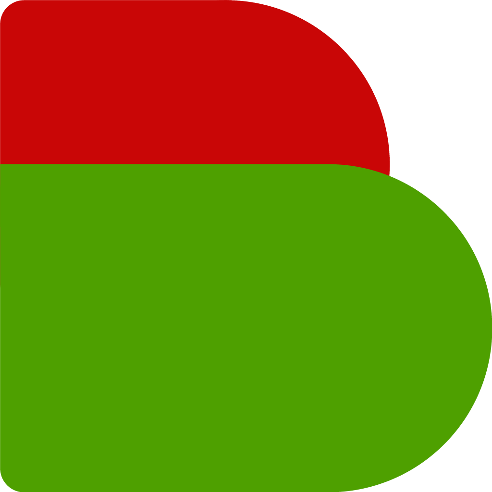

# Welkom op de brdrQ-documentatiepagina

## Introductie

**brdrQ** is een QGIS-plugin om geometrieen uit te lijnen met referentiegegevens. Ze helpt om ruimtelijke afwijkingen te corrigeren via [`brdr`](https://github.com/OnroerendErfgoed/brdr).

## Installatie

1. Open QGIS.
2. Ga naar `Plugins` -> `Manage and Install Plugins`.
3. Zoek naar `brdrQ`.
4. Klik op `Install Plugin`.
5. Na installatie verschijnt de plugin in de plugin-toolbar.

## QGIS-compatibiliteit

`brdrQ` wordt onderhouden voor:

* QGIS 3 (Qt5 / `qgis.PyQt`)
* QGIS 4 (Qt6 / `qgis.PyQt`)

Hier vind je links naar de beschikbare tools:

* [Feature aligner](featurealigner.md) - Uitlijning per feature met voorspellingen
* [Autocorrectborders (BULK)](autocorrectborders.md) - Bulkuitlijning van je data naar een referentielaag
* [GRB Updater (BULK)](autoupdateborders.md) - Bulkuitlijning naar de nieuwste GRB (Vlaanderen, Belgie)

## Mogelijke workflow

1. Gebruik [Autocorrectborders (BULK)](autocorrectborders.md) om thematische data uit te lijnen met een referentielaag. Je krijgt een `CORRECTION_`-laag met `brdrq_state`.
2. Gebruik [Feature aligner](featurealigner.md) op die `CORRECTION_`-laag om features met status `to_review` of `to_update` te herbekijken en bij te sturen.
